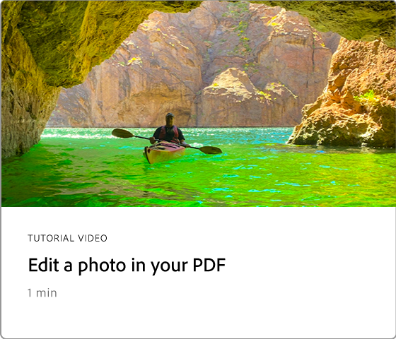
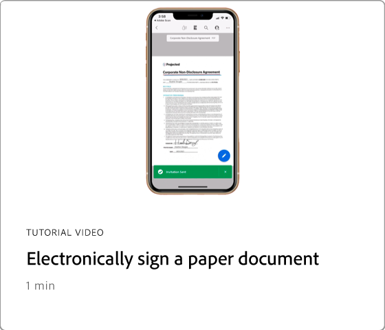
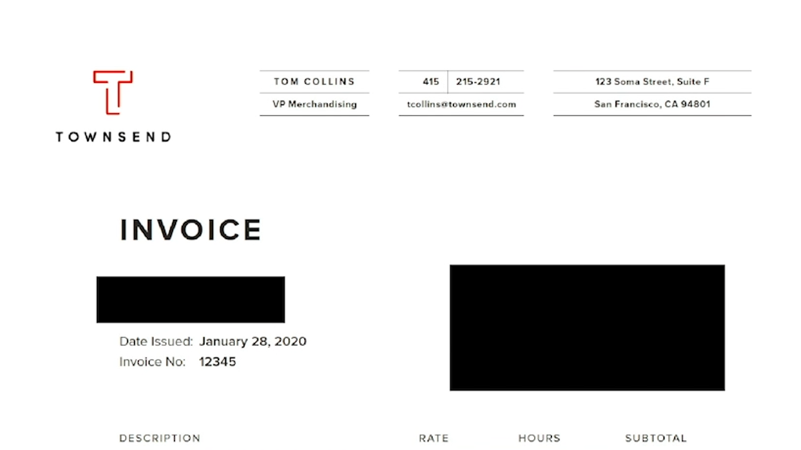

# Introducción a Acrobat de 60 segundos

La versión de 60 segundos de Acrobat te ofrece tutoriales de gran tamaño para ayudarte a aprender un nuevo truco en Acrobat en un minuto o menos. Estas sugerencias basadas en tareas le ayudan a adquirir nuevas aptitudes para trabajar con archivos de PDF desbloqueando algunas de las gemas ocultas de Acrobat. Puedes ver uno para obtener una respuesta rápida o cinco para aumentar la productividad de tu documento, y todavía tener tiempo para disfrutar de tu descanso.

## Tutoriales de Acrobat de 60 segundos

## Editar

<table style="table-layout:fixed">
<tr>
   <td>
    
  </td>
  <td>
    
  </td>
  <td>
    
  </td>
   <td>
    
  </td>
</tr>
<tr>
  <td>
    
  </td>
  <td>
    
  </td>
  <td>
      
        

         
  </td>
  <td>
      
        

         
  </td>
</tr>
</table>

## Convertir

<table style="table-layout:fixed">
<tr>
  <td>
    
  </td>
 <td>
    
  </td>
  <td>
    
  </td>
  <td>
    
  </td>
</tr>
</table>

## Crear

<table style="table-layout:fixed">
<tr>
  <td>
    
  </td>
  <td>
    
  <td>
    
  </td>
  <td>
      
  </td>
</tr>
<tr>
  <td>
    
  </td>
  <td>
      
  </td>
  <td>
      
        

         
  </td>
  <td>
      
        

         
  </td>
</tr>
</table>

## Firmar

<table style="table-layout:fixed">
<tr>
  <td>
    
  </td>
  <td>
      
        

         
  </td>
  <td>
      
        

         
  </td>
  <td>
      
        

         
  </td>
</tr>
</table>

## Proteger

<table style="table-layout:fixed">
<tr>
  <td>
    
  </td>
  <td>
    
  </td>
  <td>
      
        

         
  </td>
  <td>
      
        

         
  </td>
</tr>
</table>

## Compartir y revisar

<table style="table-layout:fixed">
<tr>
  <td>
    
  </td>
  <td>
    
  </td>
  <td>
    
  </td>
   <td>
    
  </td>
</tr>
</table>

## Preparar

<table style="table-layout:fixed">
<tr>
  <td>
    
  </td>
 <td>
    
  </td>
  <td>
      
        

         
  </td>
  <td>
      
        

         
  </td>
</tr>
</table>

## Temas adicionales

<table style="table-layout:fixed">
<tr>
  <td>
    
  </td>
 <td>
    
  </td>
  <td>
      
        

         
  </td>
  <td>
      
        

         
  </td>
</tr>
</table>