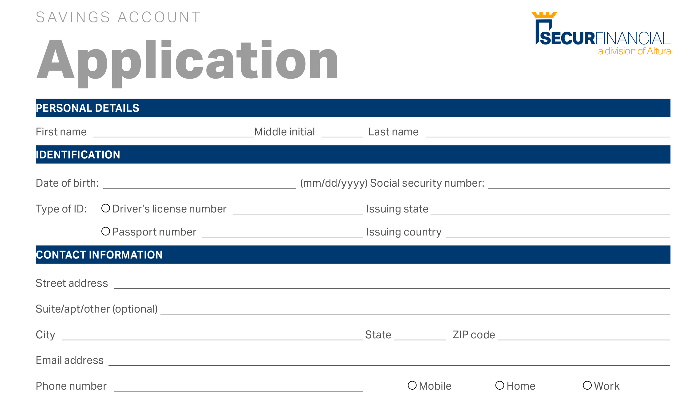

# Introducción a Acrobat de 60 segundos

La versión de 60 segundos de Acrobat te ofrece tutoriales de gran tamaño para ayudarte a aprender un nuevo truco en Acrobat en un minuto o menos. Estas sugerencias basadas en tareas le ayudan a adquirir nuevas aptitudes para trabajar con archivos de PDF desbloqueando algunas de las gemas ocultas de Acrobat. Puedes ver uno para obtener una respuesta rápida o cinco para aumentar la productividad de tu documento, y todavía tener tiempo para disfrutar de tu descanso.

## Tutoriales de Acrobat de 60 segundos

## Editar

<table style="table-layout:fixed">
<tr>
   <td>
    
    

    <a href="edit.md"><strong>Editar PDF con Acrobat Web</strong></a>
    

    Aprenda a editar en Acrobat Web
     
  </td>
  <td>
    
    

    <a href="textrecognition.md"><strong>Reconocer texto en un archivo de PDF digitalizado</strong></a>
    

    Descubre cómo reconocer texto de una imagen escaneada
     
  </td>
  <td>
    
    

    <a href="combine-to-one-pdf.md"><strong>Combinar archivos en un solo PDF</strong></a>
    

    Descubre cómo combinar archivos en un único PDF con rapidez
     
  </td>
   <td>
    
    

    <a href="organize.md"><strong>Organizar páginas en un instante</strong></a>
    

    Aprenda a organizar páginas rápidamente en un PDF
     
  </td>
</tr>
<tr>
  <td>
    
    

    <a href="editphoto.md"><strong>Edita una foto en tu PDF</strong></a>
    

    Aprenda a editar una fotografía en el PDF
  </td>
  <td>
    
    

    <a href="editgraphic.md"><strong>Editar un gráfico en el PDF</strong></a>
    

    Aprenda a editar un gráfico en el PDF
  </td>
  <td>
      
        

         
  </td>
  <td>
      
        

         
  </td>
</tr>
</table>

## Convertir

<table style="table-layout:fixed">
<tr>
  <td>
    
    

    <a href="convert-pdf-word.md"><strong>Convertir un PDF a Word</strong></a>
    

    Aprenda a convertir un PDF al formato de Word
  </td>
 <td>
    
    

    <a href="convert-pdf-excel.md"><strong>Convertir un PDF a Excel</strong></a>
    

    Aprenda a convertir un PDF al formato de Excel
  </td>
  <td>
    
    

    <a href="convert-pdf-powerpoint.md"><strong>Convertir un PDF a PowerPoint</strong></a>
    

    Aprenda a convertir un PDF al formato de PowerPoint
  </td>
  <td>
    
    

    <a href="exportwordphone.md"><strong>Export PDF a Word desde tu teléfono</strong></a>
    

    Aprenda a exportar un PDF a Word desde su teléfono
  </td>
</tr>
</table>

## Crear

<table style="table-layout:fixed">
<tr>
  <td>
    
    

    <a href="word-to-pdf.md"><strong>Crear un PDF desde Microsoft Word</strong></a>
    

    Aprenda a crear un PDF directamente desde Word
  </td>
  <td>
    
    

    <a href="create-from-acrobat.md"><strong>Crear PDF desde Acrobat</strong></a>
    

    Aprenda a crear PDF desde Acrobat
  <td>
    
    

    <a href="wordform.md"><strong>Convertir Word a PDF, incluidos los campos de formulario</strong></a>
    

    Convertir un archivo de Word en PDF y generar automáticamente campos de formulario
  </td>
  <td>
    
    

    <a href="photo.md"><strong>Crea un PDF de fotos en un instante</strong></a>
    

    Creación de un PDF de varias fotografías
  </td>
</tr>
<tr>
  <td>
    
    

    <a href="phone.md"><strong>Convertir un archivo PPT en PDF en el teléfono</strong></a>
    

    Convertir un archivo de PowerPoint a PDF en el teléfono
  </td>
  <td>
    
    

    <a href="optimize.md"><strong>Crear archivos de PDF más eficaces en un instante</strong></a>
    

    Optimiza tus archivos de PDF en un instante
  </td>
  <td>
      
        

         
  </td>
  <td>
      
        

         
  </td>
</tr>
</table>

## Firmar

<table style="table-layout:fixed">
<tr>
  <td>
    
    

    <a href="sign.md"><strong>Firmar electrónicamente un documento en papel</strong></a>
    

    Aprende a firmar electrónicamente un documento en papel
  </td>
  <td>
      
        

         
  </td>
  <td>
      
        

         
  </td>
  <td>
      
        

         
  </td>
</tr>
</table>

## Proteger

<table style="table-layout:fixed">
<tr>
  <td>
    
    

    <a href="protect.md"><strong>Protect envía los archivos del PDF con una contraseña</strong></a>
    

    Obtenga información sobre cómo proteger al PDF con una contraseña
  </td>
  <td>
    
    

    <a href="redaction.md"><strong>Censura: La Forma Correcta</strong></a>
    

    Aprende a censurar información confidencial en tu PDF de la forma correcta
  </td>
  <td>
      
        

         
  </td>
  <td>
      
        

         
  </td>
</tr>
</table>

## Compartir y revisar

<table style="table-layout:fixed">
<tr>
  <td>
    
    

    <a href="share-comment.md"><strong>Compartir un PDF para comentar</strong></a>
    

    Aprenda a compartir un PDF para que otros comenten
  </td>
  <td>
    
    

    <a href="share-comment-teams.md"><strong>Compartir y comentar archivos de PDF en Teams</strong></a>
    

    Compartir y comentar un archivo de PDF en Microsoft Teams
  </td>
  <td>
    
    

    <a href="summarize-comments.md"><strong>Discutiendo comentarios del PDF con Resumir</strong></a>
    

    Resumir todos los comentarios en un único PDF
  </td>
   <td>
    
    

    <a href="indesign.md"><strong>Cargar comentarios del PDF en el InDesign</strong></a>
    

    Descubra cómo incorporar todos los comentarios de los PDF en InDesign
  </td>
</tr>
</table>

## Preparar

<table style="table-layout:fixed">
<tr>
  <td>
    
    

    <a href="accessible.md"><strong>Deja que Acrobat te ayude a convertir en PDF accesibles</strong></a>
    

    Aprenda a hacer que su PDF sea accesible universalmente
  </td>
 <td>
    
    

    <a href="conform.md"><strong>Conformar un PDF a un formato estándar</strong></a>
    

    Aprenda a ajustar un PDF a un estándar concreto
  </td>
  <td>
      
        

         
  </td>
  <td>
      
        

         
  </td>
</tr>
</table>

## Temas adicionales

<table style="table-layout:fixed">
<tr>
  <td>
    
    

    <a href="compare.md"><strong>Detectar las diferencias con Comparación de PDF</strong></a>
    

    Aprenda a comparar rápidamente la diferencia entre dos PDF
  </td>
 <td>
    
    

    <a href="search.md"><strong>Buscar varios archivos de PDF a la vez</strong></a>
    

    Aprenda a buscar en varios archivos de PDF
  </td>
  <td>
      
        

         
  </td>
  <td>
      
        

         
  </td>
</tr>
</table>