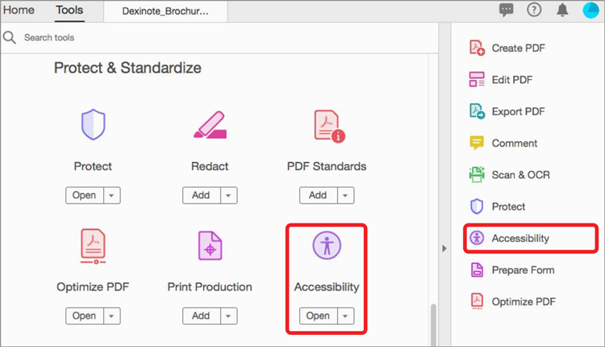

# Comprobar la accesibilidad del PDF

Aprenda a comprobar si su PDF es accesible universalmente para personas con discapacidades, incluidas personas con problemas de movilidad, ciegos, problemas de visión, sordos, auditivos o con deficiencias cognitivas.

>[!NOTE]
>
>Disponible solo en Acrobat Pro.

## Comprobación de accesibilidad

1. Seleccione **[!UICONTROL Accesibilidad]** en el centro de herramientas o en el panel derecho.

   

1. Seleccione **[!UICONTROL Comprobación de accesibilidad]** en el panel derecho.

   

1. Seleccione una categoría de la lista desplegable y elementos de la lista de comprobación.

   Deje todas las casillas marcadas para obtener un informe completo.

1. Seleccione **[!UICONTROL Iniciar comprobación]** para iniciar el informe.

    de accesibilidad

   El panel de navegación izquierdo se abre para mostrar los resultados del informe. Expanda una sección para ver los detalles.

    de accesibilidad

También puedes usar la acción [!UICONTROL Hacer accesible] en la herramienta [Action Wizard](https://experienceleague.adobe.com/docs/document-cloud-learn/acrobat-learning/advanced-tasks/action.html?lang=es), que recorre un conjunto básico de pasos para crear un PDF accesible.

## Solucionar problemas de accesibilidad

En la ventana del informe de accesibilidad, haga clic con el botón derecho en un elemento para que aparezca el menú contextual. El menú contextual de cualquier elemento que no haya superado la comprobación de accesibilidad le ofrece la opción de corregir el problema.

>[!NOTE]
>
>Algunos problemas no se pueden solucionar automáticamente y es necesario que intervenga de forma manual para corregirlos. En esos casos, >Acrobat presenta un cuadro de diálogo que le indica lo que debe corregir.