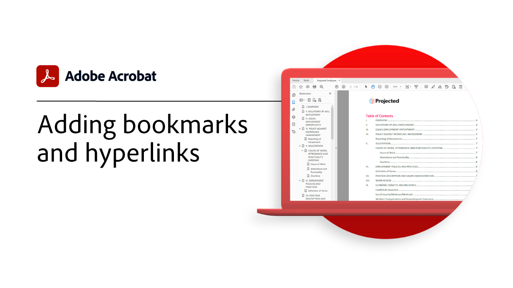
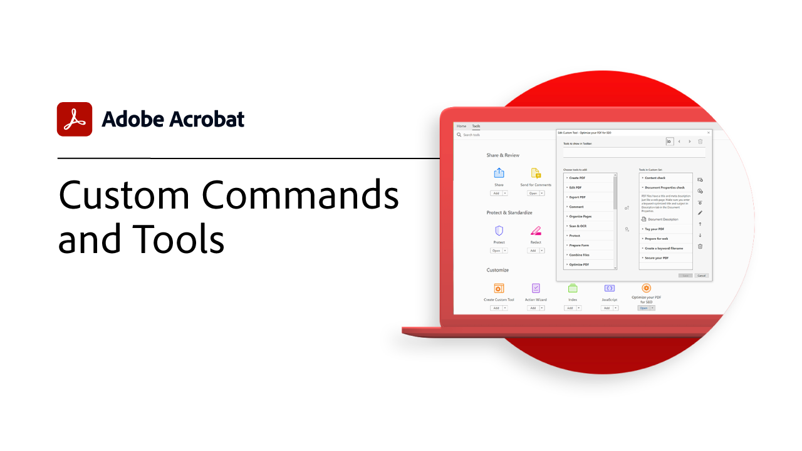
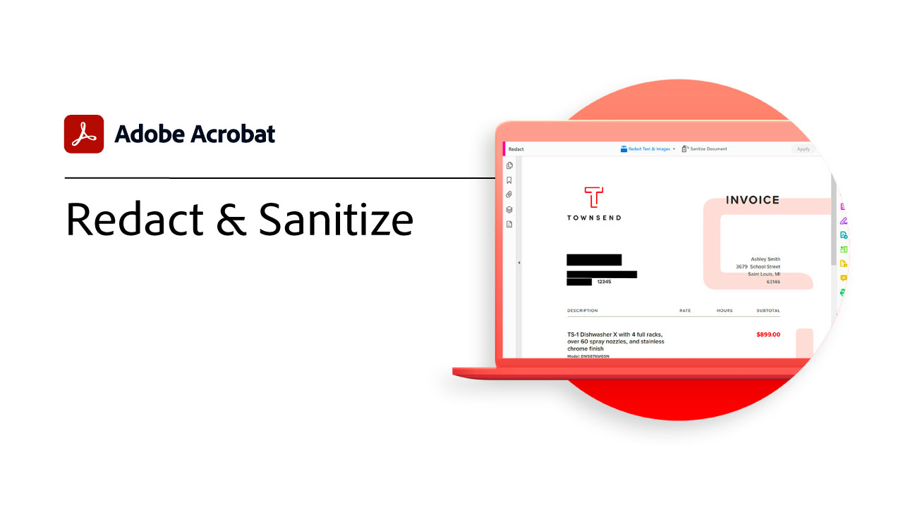

# Introducción a tareas avanzadas

Ve más allá de lo básico con estas herramientas avanzadas de Acrobat. Aprenda a crear una acción para repetir tareas rutinarias, quitar información confidencial, reducir y optimizar archivos grandes, recopilar rápidamente datos de formulario y crear archivos de PDF de acceso universal.

## Tutoriales de Acrobat

<table style="table-layout:fixed">
<tr>
  <td>
    
    

    <a href="bookmarks.md"><strong>Añadir marcadores e hipervínculos</strong></a>
    

    <em>Aprenda a agregar marcadores e hipervínculos para una mejor navegación e interacción</em>
     
  </td>
  <td>
    
    

    <a href="optimizescan.md"><strong>Optimizar documentos digitalizados</strong></a>
    

    <em>Aprenda a mejorar los documentos digitalizados para una mejor experiencia de visualización y búsqueda de PDF</em>
     
  </td>
  <td>
    
    

    <a href="custom.md"><strong>Comandos y herramientas personalizados</strong></a>
    

    <em>Mejorar la productividad del flujo de trabajo de documentos mediante el uso de comandos y herramientas personalizadas</em>
     
  </td>
</tr>
<tr>
   <td>
    
    

    <a href="advancedforms.md"><strong>Campos de formulario avanzados</strong></a>
    

    <em>Aprende técnicas avanzadas para formar PDF forms profesionales</em>
     
  </td>
 <td>
    
    

    <a href="optimizeseo.md"><strong>Optimize PDF para SEO (Search Engine Optimization)</strong></a>
    

    <em>Optimizar un PDF para mejorar la capacidad de detección y la clasificación de los motores de búsqueda en la web</em>
     
  </td>
  <td>
    
    

    <a href="workforms.md"><strong>Trabajar con campos de formulario</strong></a>
    

    <em>Agregue diversos tipos de campos de formulario, establezca las propiedades de los campos de formulario y añada seguridad para crear formularios profesionales de alta calidad</em>
     
  </td>
</tr>
<tr>
  <td>
    
    

    <a href="enhance.md"><strong>Mejorar su PDF</strong></a>
    

    <em>Transforme su PDF añadiendo mejoras gráficas y numeración automática</em>
     
  </td>
 <td>
    
    

    <a href="compare.md"><strong>Detectar diferencias entre dos PDF</strong></a>
    

    <em>Detecte de forma rápida y precisa las diferencias entre dos archivos de PDF</em>
     
  </td>
  <td>
    
    

    <a href="action.md"><strong>Action Wizard</strong></a>
    

    <em>Ahorra tiempo y pulsaciones de teclas usando una acción para aplicar automáticamente un conjunto de comandos a uno o varios archivos</em>
     
  </td>
</tr>
<tr>
 <td>
    
    

    <a href="redact.md"><strong>Censurar y Corregir</strong></a>
    

    <em>Quita permanentemente información privada o confidencial del PDF</em>
     
  </td>
 <td>
    
    

    <a href="reduce.md"><strong>Reducir el tamaño del archivo y optimizar</strong></a>
    

    <em>Reduce archivos grandes y optimiza a tus PDF sin comprometer la calidad para compartir, publicar o archivar</em>
     
  </td>
  <td>
    
    

    <a href="formdata.md"><strong>Trabajar con datos de formulario</strong></a>
    

    <em>Compilar datos de formulario en una sola hoja de cálculo</em>
     
  </td>
</tr>
<tr>
 <td>
    
    

    <a href="accessibility.md"><strong>Comprobar Accesibilidad Del PDF</strong></a>
    

    <em>Compruebe si su PDF es universalmente accesible para las personas con discapacidades</em>
     
  </td>
 <td>
    
    

    <a href="accessibility-series.md"><strong>Serie de accesibilidad de Acrobat</strong></a>
    

    <em>En esta serie de seminarios web bajo demanda de seis partes, pasa de lo básico sobre accesibilidad a profundizar en el etiquetado de archivos de PDF</em>
     
  </td>
  <td>
   
    

     
  </td>  
</tr>
</table>
