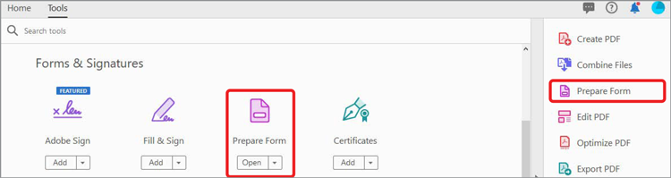
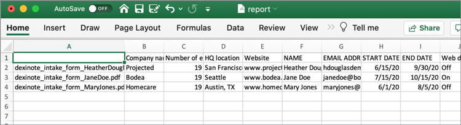

# Trabajar con datos de formulario

Si tiene un conjunto de formularios completados y necesita compilar los datos, puede utilizar Acrobat para combinar las respuestas en una sola hoja de cálculo.

1. Empiece colocando todos los PDF forms completados en una carpeta del equipo.

   

1. Abra uno de los archivos de formulario completados y seleccione **[!UICONTROL Prepare Form]** en el centro de herramientas o en el panel derecho.

   

1. Seleccionar **[!UICONTROL Más]** **>** **[!UICONTROL Combinar archivos de datos en hoja de cálculo]** en el panel derecho.

   

1. Seleccione la carpeta que creó con los formularios completados.

   Acrobat extrae los datos de cada formulario y crea una hoja de cálculo de todos los datos.

   
