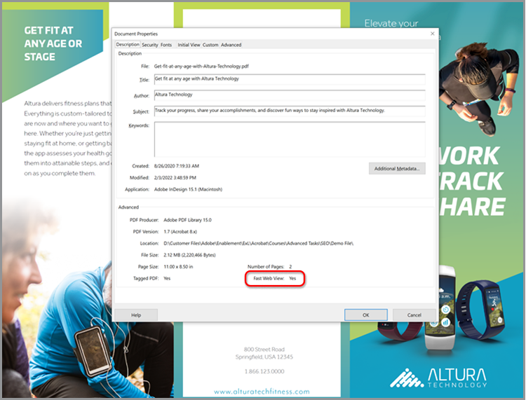

# Optimize PDF para SEO (Search Engine Optimization)

Aprenda a optimizar un PDF para mejorar la capacidad de detección y la clasificación de los motores de búsqueda en la web.

## 1. Crear contenido único

Cree contenido de PDF diferente de la información de las páginas Web.

+++Ver detalles sobre cómo crear contenido único

El contenido del PDF debe ser único y estar estructurado de la siguiente manera:

* Utilizar un único título o encabezado principal que empiece por una palabra clave
* Usar subencabezados de palabras clave organizados en una estructura jerárquica
* Utilizar párrafos cortos que contengan palabras clave y listas
* Añadir hipervínculos internos y externos (contenido de su sitio web u otros sitios web)
* Agregar una tabla de contenido con hipervínculos para documentos de más de 25 páginas
* Ejecutar [reconocimiento de texto](https://experienceleague.adobe.com/docs/document-cloud-learn/acrobat-learning/getting-started/scan-and-ocr.html) en todos los documentos digitalizados
* Crear PDF compatibles con dispositivos móviles Para comprobar la experiencia de visualización móvil de su PDF, abra el archivo en la [Aplicación móvil de Acrobat Reader](https://www.adobe.com/acrobat/mobile/acrobat-reader.html) y active Liquid Mode. Incluir subtítulos adicionales si es necesario para mejorar la navegación.

   

+++

  

## 2. Añadir propiedades del documento

Los archivos de PDF tienen un título y una meta descripción, como una página web.

+++Ver detalles sobre cómo añadir propiedades de documento

Agregar clave **[!UICONTROL Propiedades del documento]** como sigue:

1. Seleccionar **[!UICONTROL Archivo > Propiedades]** o utilice el método abreviado de teclado *Ctrl + D* en Windows o *Cmd + D* en Mac y seleccione la **[!UICONTROL Descripción]** .
1. Introduzca un título optimizado para palabras clave en el **[!UICONTROL Título:]** campo.
1. Asegúrese de que el **[!UICONTROL Autor:]** no identifica a una persona específica dentro de su organización.
1. Introduzca un resumen del documento optimizado para palabras clave en la **[!UICONTROL Asunto:]** campo.
Prueba a empezar el resumen usando un verbo de acción como Aprender, Descubrir, Explorar, etc.
1. Seleccionar **[!UICONTROL Metadatos adicionales]** para añadir información de copyright o de dominio público, si procede.

   

+++

  

## 3. Etiquetar el PDF

El etiquetado de contenido en el PDF no solo crea el archivo [Accesible](https://experienceleague.adobe.com/docs/document-cloud-learn/acrobat-learning/advanced-tasks/accessibility.html) a las personas con discapacidades, también mejora el SEO.

+++Ver detalles sobre cómo etiquetar a un PDF

Etiquete un PDF de la siguiente manera:

1. Seleccionar **[!UICONTROL Accesibilidad]** en el **[!UICONTROL Herramientas]** centro.
1. Seleccionar **[!UICONTROL Etiquetar documento automáticamente]** en el panel derecho.
1. Siga las sugerencias de reparación en el panel izquierdo **[!UICONTROL Informe de reconocimiento]**.
1. Ejecutar **[!UICONTROL Establecer texto alternativo]** si es necesario.
1. Utilice palabras clave para describir la imagen en el **[!UICONTROL Texto alternativo]**.

   

+++

>[!NOTE]
>
>Disponible solo en Acrobat Pro.

  

## 4. Prepárate para la web

Optimice la experiencia de interacción con el PDF preparándolo para la visualización en la Web y [reducir el tamaño de archivo del PDF](https://www.adobe.com/es/acrobat/online/compress-pdf.html){target="_blank"}.

+++Ver detalles sobre cómo preparar al PDF para la Web

Prepare a su PDF para Internet de la siguiente manera:

Para preparar al PDF para la Web, seleccione **[!UICONTROL Archivo > Guardar como otro > PDF de tamaño reducido]**.

Este paso reduce el tamaño del archivo y permite **Vista rápida en Web** en el PDF. **Vista rápida en Web** permite abrir, ver y buscar el archivo inmediatamente antes de que se transmita o descargue todo el archivo, lo que crea una experiencia óptima para el usuario final. Abrir **[!UICONTROL Propiedades del documento]** (*Ctrl + D* en Windows o *Cmd + D* en Mac) para determinar si **Vista rápida en Web** está activado.

>[!TIP]
>
>Si tiene Acrobat Pro, ejecute Optimizar para Web y dispositivos móviles en la herramienta Action Wizard. Esta acción convierte los colores en sRGB e incrusta las fuentes para una visualización coherente de los PDF en los navegadores y dispositivos móviles.

+++

  

## 5. Cree un nombre de archivo de palabra clave

+++Ver detalles sobre cómo crear un nombre de archivo de palabra clave

Cree un nombre de archivo de palabra clave de la siguiente manera:

El nombre de archivo pasa a formar parte de la dirección URL cuando se publica un PDF en Internet. Se recomienda hacer coincidir el título optimizado para palabras clave con el nombre del archivo. Para facilitar la búsqueda, utilice minúsculas, sin puntuación ni hash, y evite las palabras de detención (a, an, the, and, it, for, or, but, in, my, your, our, and their, etc.). Si utiliza palabras separadas, agregue guiones o guiones bajos entre las palabras.

+++

  

## 6. Proteja su PDF

El último paso es [proteja a su PDF](https://www.adobe.com/es/acrobat/online/password-protect-pdf.html){target="_blank"} para evitar cambios no autorizados.

+++Ver detalles sobre cómo proteger el PDF

Proteja un PDF de la siguiente manera:

1. Abrir **[!UICONTROL Propiedades del documento]** (*Ctrl + D* en Windows o *Cmd + D* en Mac) y seleccione la **[!UICONTROL Seguridad]** .
1. Comprobar **[!UICONTROL Imprimir la edición e impresión del documento. Se requerirá una contraseña para poder cambiar esta configuración.]**
1. Bajo **[!UICONTROL Cambios permitidos:]** seleccionar **[!UICONTROL Ninguno]**.
1. Comprobar **[!UICONTROL Habilite el acceso al texto para dispositivos lectores de pantalla para personas con problemas de visión.]**
1. Introduzca y confirme una contraseña segura.
1. Seleccionar **[!UICONTROL OK]** y guarde el archivo.

   

+++

Ahora tu PDF está listo para publicarse en la web, con un potencial óptimo de clasificación de palabras clave e interacción con el usuario final.
