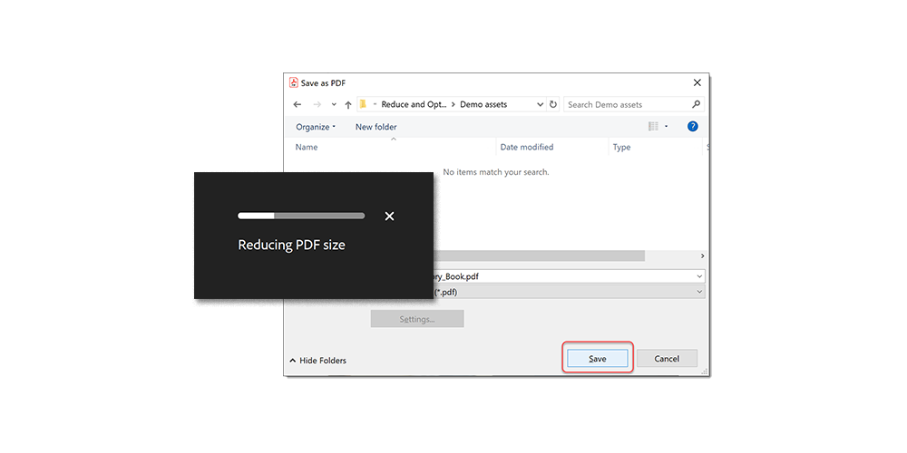

# Reducir el tamaño del archivo y optimizar

Reduce archivos grandes y optimiza tus PDF sin comprometer la calidad para compartir, publicar o archivar.

>[!NOTE]
>
>Disponible solo en Acrobat Pro.

1. Seleccionar **[!UICONTROL Optimize PDF]** de la [!UICONTROL Herramientas] panel central o derecho.

   

1. Seleccionar **[!UICONTROL Reducir tamaño de archivo]** y elija si desea reducir uno o varios archivos.

   El archivo se reduce al tamaño más pequeño posible, conservando la calidad del documento.

   

1. Seleccionar **[!UICONTROL Optimización avanzada]** y, a continuación, elija una de las opciones del Optimizador de PDF.

   

1. Seleccionar **[!UICONTROL Estándar]** de la **[!UICONTROL Configuración]** para utilizar la configuración predeterminada.

   Si cambia alguna configuración en el **[!UICONTROL PDF Optimizer]** , el cuadro de diálogo **Configuración** el menú cambia automáticamente a **Personalizado**.

1. Seleccionar **[!UICONTROL Conservar existente]** de la **[!UICONTROL Hacer compatible con]** para mantener la versión actual del PDF o elegir una versión específica de Acrobat.

1. Seleccione la casilla de verificación junto a un panel (por ejemplo, Imágenes, Fuentes o Transparencia) y, a continuación, elija las opciones de ese panel.

   

   Para evitar que todas las opciones de un panel se ejecuten durante la optimización, anule la selección de la casilla de ese panel.

1. **(Opcional)** Seleccionar **[!UICONTROL Guardar]** y asigne un nombre a la configuración actual para crear una selección personalizada. Para eliminar un ajuste guardado, elíjalo en el **Configuración** y seleccione **Eliminar**.

   

>[!TIP]
>
>Para optimizar varios archivos de PDF, pruebe a utilizar la [Action Wizard](../advanced-tasks/action.md).