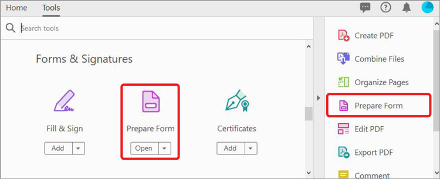
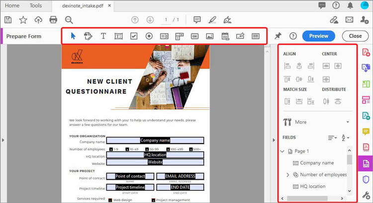

# Crear formularios rellenables

Convierta un formulario o documento en papel digitalizado creado en InDesign, Microsoft Word, Excel u otra aplicación en un formulario PDF rellenable en Acrobat DC.

1. Seleccione **[!UICONTROL Prepare Form]** en el centro [!UICONTROL Herramientas].

   

1. Seleccione un documento existente para utilizarlo como formulario (por ejemplo, un archivo de Word, Excel, InDesign o PDF).

   Si [!UICONTROL Detección automática de campos de formulario] está activada, Acrobat detecta automáticamente los campos de formulario en el PDF.

1. Haga clic en **[!UICONTROL Iniciar]** para crear el formulario.

   

   Edite el formulario con las opciones que se muestran. Arrastre y suelte campos desde la barra de menús superior y edite los detalles de los campos de formulario en el panel derecho.

1. Haga clic en **[!UICONTROL Vista previa]** para ver el formulario después de agregar los campos.

   

   Vuelva fácilmente a **[!UICONTROL Editar]** para continuar con el trabajo.

   

1. Haga clic en **[!UICONTROL Archivo > Guardar como]** para guardar el formulario PDF.

Haga clic para descargar un PDF del tutorial *Crear formularios rellenables*.

