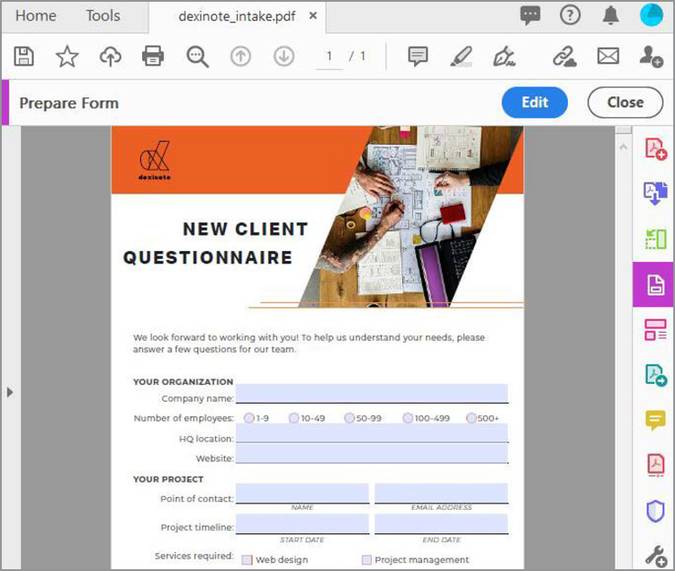

# Crear formularios rellenables

Convertir un formulario o documento en papel digitalizado creado en InDesign, Microsoft Word, Excel u otra aplicación en un [formulario de PDF rellenable](https://www.adobe.com/es/acrobat/online/sign-pdf.html).

1. Seleccionar **[!UICONTROL Prepare Form]** de la [!UICONTROL Herramientas] panel central o derecho.

   

1. Seleccione un documento existente para utilizarlo como formulario (por ejemplo, un archivo de Word, Excel, InDesign o PDF) y seleccione **Inicio**.

   

   Si [!UICONTROL Detección automática del campo de formulario] es **ACTIVADO**, los campos de formulario se detectan automáticamente en el archivo de PDF. Compruebe la colocación de los campos de formulario.

   Arrastre y suelte campos desde el menú superior y edite los detalles de los campos de formulario en el panel derecho.

1. Seleccionar **[!UICONTROL Vista previa]** para ver tu formulario.

   

1. Seleccionar **[!UICONTROL Editar]** para continuar trabajando, o seleccione **[!UICONTROL Archivo]** **>** **[!UICONTROL Guardar como]** para guardar el formulario de PDF.

   

>[!TIP]
>
>Profundiza en la creación de formularios con estos [técnicas avanzadas](../advanced-tasks/advancedforms.md).