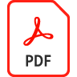

# Crear un PDF

Aprende a [crear PDF a partir de todos los diferentes tipos de documentos](https://www.adobe.com/es/acrobat/online/convert-pdf.html). Empieza con un archivo creado en Microsoft Office o una aplicación de Creative Cloud, o utiliza una imagen, una digitalización o incluso un sitio web. Convertir el contenido en PDF proporciona una forma cómoda y fiable de compartir, conservar y proteger documentos al tiempo que se mantiene el formato original. Este tutorial de vídeo utiliza la [experiencia n](new-experience.md).

>[!TIP]
>
>¿Utiliza Microsoft Office todo el tiempo? Echa un vistazo a estas [integraciones](../integrate/integrate-overview.md#microsoft) que te permiten crear PDF directamente dentro de tus aplicaciones favoritas de Office.

  

>[!VIDEO](https://video.tv.adobe.com/v/35491?enablevpops&quality=12&learn=on&hidetitle=true)

¿Quieres una versión portátil de este tutorial? Seleccione el icono del PDF para abrir o descargar una versión escrita de este tutorial.

{target="blank"}