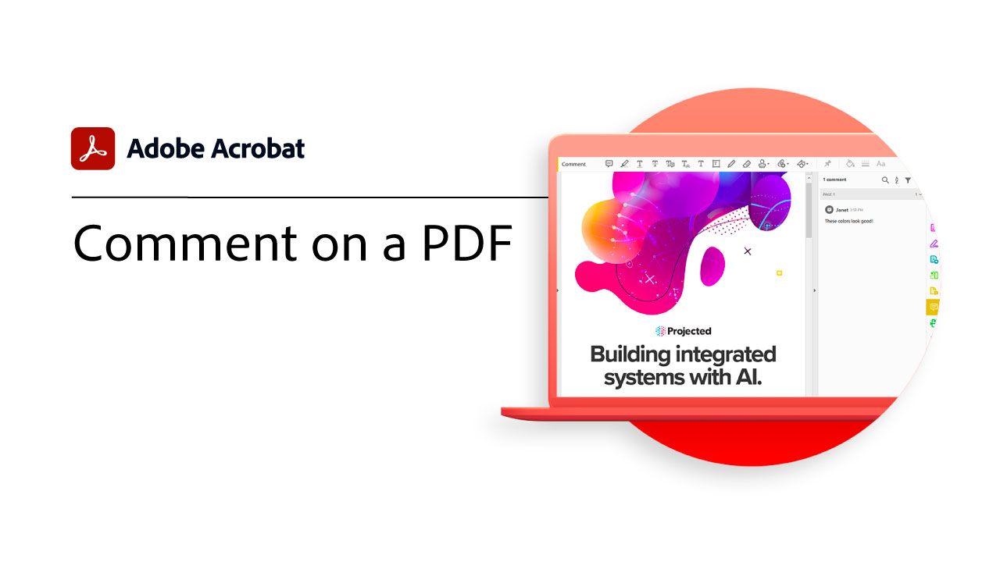
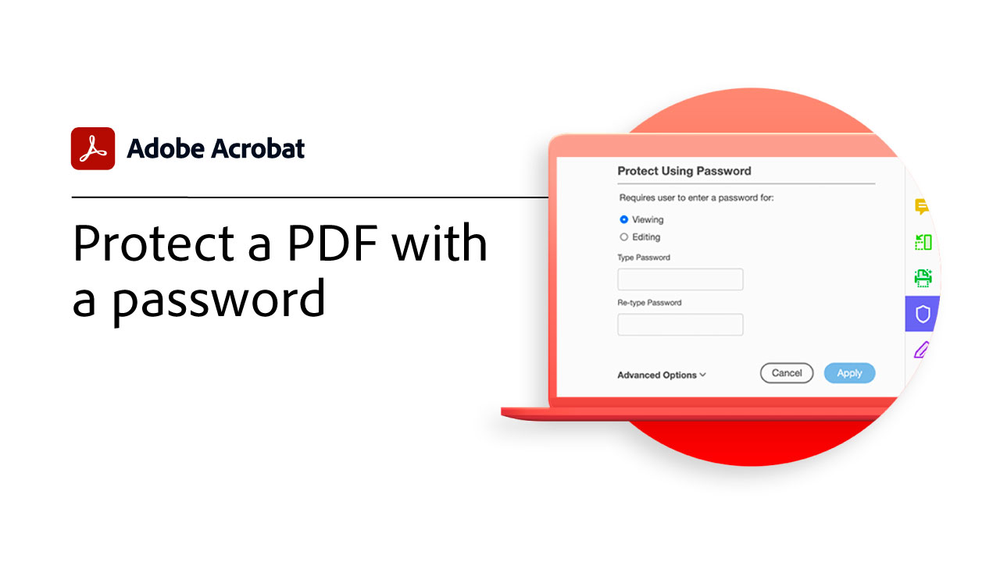

# Introducción

Aprenda a empezar a utilizar Adobe Acrobat a través de estos breves tutoriales paso a paso (de 1 a 2 minutos). Desde la creación de un documento hasta la protección de los archivos PDF, este contenido está diseñado para facilitar los flujos de trabajo de los PDF.

## Tutoriales de Acrobat

<table style="table-layout:fixed">
<tr>
  <td>
    
    

    <a href="get-to-know-the-acrobat-dc-interface.md"><strong>Familiarícese con la interfaz de Acrobat DC</strong></a>
    

    <em>Vea cómo la interfaz de Adobe Acrobat DC facilita el acceso a archivos y herramientas en el escritorio, la Web y dispositivos móviles</em>
     
  </td>
  <td>
    
    

    <a href="acrobatweb.md"><strong>Trabajar en cualquier lugar con Acrobat web</strong></a>
    

    <em>Aprenda a gestionar las solicitudes de documentos empresariales desde cualquier lugar mediante las herramientas web de Acrobat en el navegador</em>
     
  </td>
  <td>
    
    

     <a href="../integrate/integrate-overview.md#microsoft"><strong>Uso de Microsoft 365</strong></a>
    

    <em>Aumente la productividad y los flujos de trabajo de documentos empresariales con Acrobat y [!DNL Microsoft 365]</em>
     
  </td>
</tr>
<tr>
   <td>
    
    

     <a href="collaborate.md"><strong>Colaboración en tiempo real</strong></a>
    

    <em>Avanza tus proyectos recopilando comentarios, colaborando en respuestas y realizando un seguimiento del progreso de tus documentos en tiempo real, desde cualquier lugar</em>
     
  </td>
  <td>
    
    

     <a href="combine-to-pdf.md"><strong>Combinación de archivos en PDF</strong></a>
    

    <em>Combinación de muchos tipos diferentes de archivos en un solo PDF</em>
     
  </td>
  <td>
    
    

    <a href="create-pdf.md"><strong>Creación de un PDF</strong></a>
    

    <em>Crear PDF de todos los tipos de documentos</em>
     
  </td>
</tr>
<tr>
  <td>
    
    

    <a href="comment-on-pdf-files.md"><strong>Comentario en un PDF</strong></a>
    

    <em>Añadir comentarios a un archivo PDF y, a continuación, compartirlo con otros usuarios</em>
     
  </td>
  <td>
    
    

    <a href="edit-pdf.md"><strong>Editar un PDF</strong></a>
    

    <em>Edición de texto e imágenes en archivos PDF</em>
     
  </td>
   <td>
    
    

    <a href="export-pdf.md"><strong>Exportación de un PDF a formatos editables</strong></a>
    

    <em>Aprenda a exportar los archivos de PDF a formatos editables</em>
     
  </td>
</tr>
<tr>
  <td>
    
    

    <a href="create-fillable-forms.md"><strong>Crear formularios rellenables</strong></a>
    

    <em>Convertir un documento creado en otra aplicación en un formulario PDF que se puede rellenar</em>
     
  </td>
  <td>
    
    

    <a href="scan-and-ocr.md"><strong>Digitalización y OCR</strong></a>
    

    <em>Reduzca los archivos grandes y optimice a sus PDF sin comprometer la calidad para compartir, publicar o archivar</em>
     
  </td>
  <td>
    
    

    <a href="organize.md"><strong>Organizar páginas</strong></a>
    

    <em>Añadir, reemplazar, extraer, rotar, eliminar y mover páginas en el PDF</em>
     
  </td>
</tr>
<tr>
  <td>
    
    

    <a href="password-protect.md"><strong>Protect un archivo de PDF con una contraseña</strong></a>
    

    <em>Añada una contraseña a su PDF para evitar que otros usuarios abran o editen el archivo</em>
     
  </td>
  <td>
    
    

    <a href="fill-and-sign.md"><strong>Fill and sign PDF forms</strong></a>
    

    <em>Rellenar y firmar rápidamente un formulario de PDF</em>
     
  </td>
  <td>
    
    

    <a href="where-do-pdfs-come-from.md"><strong>¿De dónde vienen los PDF?</strong></a>
    

    <em>Comprender de dónde vienen los PDF y sus usos</em>
     
  </td>
</tr>
</table>
