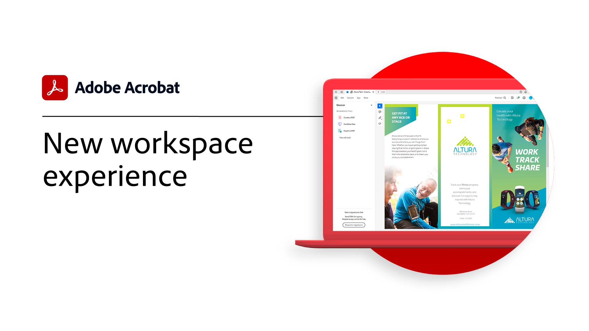
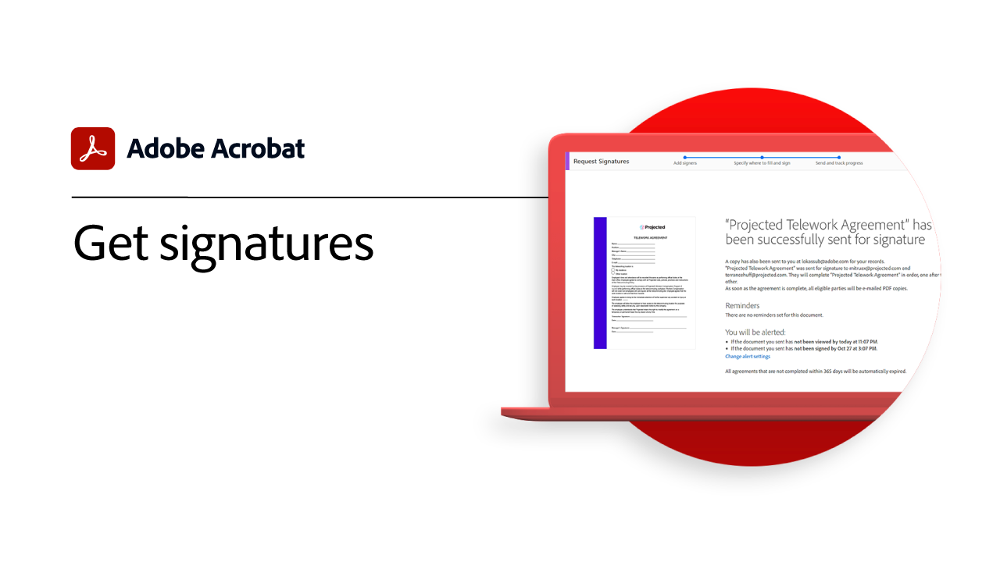

# Introducción a la introducción

Aprende a usar Adobe Acrobat con estos breves tutoriales paso a paso. Desde la creación de un documento hasta la protección o [editar los archivos de PDF](https://www.adobe.com/es/acrobat/online/pdf-editor.html){target="_blank"}, este contenido está diseñado para facilitarle los flujos de trabajo de PDF.

## Novedades

* [Edición de texto en un PDF](edit-pdf.md)
Aprende a editar palabras, frases o incluso páginas enteras en tu PDF

* [Crear un PDF](create-pdf.md)
Aprenda a crear PDF a partir de todos los diferentes tipos de documentos

## Tutoriales de introducción

<table style="table-layout:fixed">
<tr>
  <td>
    
    

    <a href="get-to-know-the-acrobat-dc-interface.md"><strong>Conceptos básicos del espacio de trabajo</strong></a>
    

    <em>Descubre cómo el espacio de trabajo de Acrobat facilita el acceso a archivos y herramientas en equipos de escritorio, la Web y dispositivos móviles</em>
     
  </td>
  <td>
    
    

    <a href="new-workspace.md"><strong>Nueva experiencia de espacio de trabajo</strong></a>
    

    <em>Obtenga más información sobre la nueva experiencia de espacio de trabajo que puede activar en Acrobat</em>
     
  </td>
  <td>
    
    

    <a href="acrobatweb.md"><strong>Trabaja en cualquier parte con Acrobat web</strong></a>
    

    <em>Aprende a gestionar solicitudes de documentos empresariales desde cualquier lugar con las herramientas web de Acrobat en tu navegador</em>
     
  </td>
  <td>
    
    

     <a href="productivity.md"><strong>Productividad sobre la marcha</strong></a>
    

    <em>Haz más directamente desde tu tableta o teléfono móvil con la aplicación móvil de Acrobat Reader</em>
     
  </td>
</tr>
<tr>
    <td>
      
      

      <a href="../integrate/integrate-overview.md#microsoft"><strong>Trabajar con Microsoft 365</strong></a>
      

      <em>Aumenta la productividad y los flujos de trabajo de los documentos empresariales con Acrobat y [!DNL Microsoft 365]</em>
       
    </td>
    <td>
      
      

      <a href="where-do-pdfs-come-from.md"><strong>¿De dónde vienen los PDF?</strong></a>
      

      <em>Entender de dónde vienen los PDF y sus usos</em>
       
    </td>
    <td>
    
      

       
    </td>
    <td>
    
      

       
    </td>
  </tr>
  </table>

## Creación, combinación y organización de tutoriales

<table style="table-layout:fixed">
  <tr>
    <td>
      
      

      <a href="create-pdf.md"><strong>Crear un PDF</strong></a>
      

      <em>Crea PDF de todos los tipos de documentos</em>
       
    </td>
    <td>
      
      

      <a href="combine-to-pdf.md"><strong>Combinar archivos en PDF</strong></a>
      

      <em>Combine muchos tipos diferentes de archivos en un solo PDF</em>
       
    </td>
    <td>
      
      

      <a href="organize.md"><strong>Organizar páginas</strong></a>
      

      <em>Añade, reemplaza, extrae, rota, elimina y reorganiza las páginas en tu PDF</em>
       
    </td>
    <td>
      
      

      <a href="add-custom-page.md"><strong>Añadir página personalizada</strong></a>
      

      <em>Aprenda a añadir páginas personalizadas a su PDF mediante la aplicación de Adobe Express integrada</em>
       
    </td>
  </tr>
  </table>

## Edición y exportación de tutoriales

<table style="table-layout:fixed">
  <tr>
    <td>
      
      

      <a href="edit-pdf.md"><strong>Edición de texto en un PDF</strong></a>
      

      <em>Aprenda a editar texto en un PDF</em>
       
    </td>
    <td>
      
      

      <a href="stylize-this-PDF.md"><strong>Estilizar este PDF</strong></a>
      

      <em>Más información sobre el nuevo modo de edición que ajusta automáticamente el contenido</em>
       
    </td>
   <td>
      
      

      <a href="auto-adjust-layout.md"><strong>Ajustar diseño automáticamente</strong></a>
      

      <em>Más información sobre el nuevo modo de edición que ajusta automáticamente el contenido</em>
       
    </td>
    <td>
      
      

      <a href="export-pdf.md"><strong>Exportación de un PDF a formatos editables</strong></a>
      

      <em>Aprenda a exportar archivos de PDF a formatos editables</em>
       
    </td>
  </tr>
  </table>

## Tutoriales de colaboración

<table style="table-layout:fixed">
  <tr>
    <td>
      
      

      <a href="collaborate.md"><strong>Colabora en tiempo real</strong></a>
      

      <em>Lleva tus proyectos más allá recopilando comentarios, colaborando en las respuestas y realizando el seguimiento del progreso de tus documentos, todo ello en tiempo real y desde cualquier lugar</em>
       
    </td>
    <td>
      
      

      <a href="comment-on-pdf-files.md"><strong>Comentar en un PDF</strong></a>
      

      <em>Agregue comentarios a un archivo de PDF y compártalo con otros usuarios</em>
       
    </td>
    <td>
    
      

       
    </td>
    <td>
    
      

       
    </td>
</tr>
</table>

## Tutoriales adicionales

<table style="table-layout:fixed">
<tr>
  <td>
    
    

    <a href="create-fillable-forms.md"><strong>Crear formularios rellenables</strong></a>
    

    <em>Convertir un documento creado en otra aplicación en un formulario de PDF que se puede rellenar</em>
     
  </td>
  <td>
    
    

    <a href="fill-and-sign.md"><strong>PDF forms de Fill &amp; Sign</strong></a>
    

    <em>Rellene y firme rápidamente un formulario de PDF</em>
     
  </td>
  <td>
    
    

    <a href="scan-and-ocr.md"><strong>Digitalización y OCR</strong></a>
    

    <em>Reduce archivos grandes y optimiza a tus PDF sin comprometer la calidad para compartir, publicar o archivar</em>
     
  </td>
  <td>
    
    

    <a href="password-protect.md"><strong>Protect crea un archivo de PDF con una contraseña</strong></a>
    

    <em>Agregue una contraseña a su PDF para evitar que otros usuarios abran o editen el archivo</em>
     
  </td>
</tr>
<tr>
  <td>
    
    

    <a href="signatures.md"><strong>Obtener firmas</strong></a>
    

    <em>Mantén tu empresa en marcha recopilando firmas electrónicas legalmente vinculantes de otras personas, desde cualquier lugar</em>
     
  </td>
  <td>
    
    

    <a href="track.md"><strong>Realizar un seguimiento de documentos</strong></a>
    

    <em>Saber siempre qué archivos están esperando firmas y cuáles se han firmado</em>
     
  </td>
  <td>
   
    

     
  </td>
  <td>
   
    

     
  </td>
</tr>
</table>
