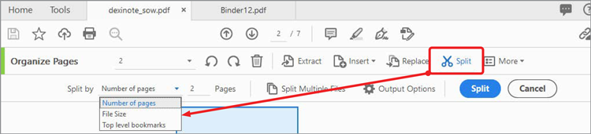

# Organizar páginas

Use **[!UICONTROL Organizar páginas]** en Acrobat DC para agregar, reemplazar, extraer, rotar, eliminar y mover páginas del PDF.

1. Seleccione **[!UICONTROL Organizar páginas]** en el centro [!UICONTROL Herramientas].

   

1. Pase el ratón por encima de una página para rotarla hacia la derecha o hacia la izquierda, o bien para eliminarla.

   Para mover una página, haga clic en ella y arrástrela a la nueva ubicación.

   

1. Haga clic en **[!UICONTROL Extraer]** en la barra de herramientas para crear un nuevo PDF a partir de una o más páginas.

1. Seleccione la página o páginas y, a continuación, haga clic en el botón **[!UICONTROL Extraer]**.

   También puede **[!UICONTROL Insertar]** o **[!UICONTROL Reemplazar]** páginas y ver otras opciones haciendo clic en **[!UICONTROL Más]**.

   

1. Seleccione **[!UICONTROL Dividir]** para separar uno o más PDF en varios PDF más pequeños.

   Al dividir un PDF, puede separarlo por el número de páginas, el tamaño de archivo o los marcadores de nivel superior.

   

Haga clic para descargar un PDF del tutorial de *Organizar páginas*.

