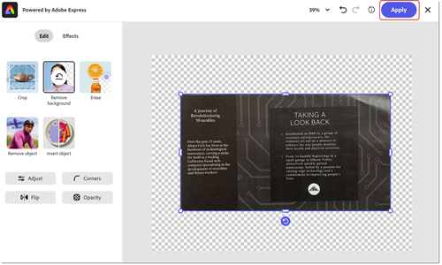

# De papel a PDF

Aprende a escanear (o tomar una foto) un documento en papel y convertirlo en un [archivo de PDF editable](https://www.adobe.com/es/acrobat/online/pdf-editor.html){target="_blank"} en el que se puedan realizar búsquedas. Convertir documentos impresos en PDF aumenta tu capacidad de encontrar información rápidamente y hacerla accesible a las personas discapacitadas. Este tutorial muestra la [nueva experiencia de Acrobat](new-workspace.md).

## Cómo convertir el papel en un PDF en Acrobat para escritorio

1. Abra una fotografía o una imagen digitalizada de un documento. También puedes crear un archivo nuevo usando un escáner conectado o usar la [aplicación móvil Adobe Scan](https://adobescan.app.link/GpBqG8Bkoeb) gratuita.

1. Seleccione **[!UICONTROL Todas las herramientas]** en la barra de herramientas y elija **[!UICONTROL Digitalizar y OCR]** en el panel izquierdo.

   

1. Elige **[!UICONTROL Mejorar imagen escaneada]** o **[!UICONTROL Mejorar imagen de cámara]** según tu tipo de archivo.

   

1. Arrastre los controladores para ajustar los bordes de página y seleccione **[!UICONTROL Mejorar]**.

   

   Acrobat limpia y endereza la imagen automáticamente.

1. Selecciona **[!UICONTROL En este archivo]** y elige **[!UICONTROL Reconocer texto]** para que el texto se pueda buscar y editar.

   

El archivo es ahora un archivo de PDF editable y en el que se pueden realizar búsquedas.

## Cómo convertir el papel en un PDF en la web de Acrobat

1. Inicie sesión en [acrobat.adobe.com](https://acrobat.adobe.com/es/es) en un explorador.

1. Seleccione **[!UICONTROL Convertir > Reconocer texto con OCR]** en el menú superior.

   

1. Elige **[!UICONTROL Seleccionar archivos]**, elige tu archivo y selecciona **[!UICONTROL Abrir]**.

   

1. Seleccione **[!UICONTROL Reconocer texto]**.

   

   El texto del archivo ahora se puede buscar y editar.

1. Para quitar el fondo, selecciona la imagen y elige **[!UICONTROL Editar imagen]**.

   

1. Seleccione **[!UICONTROL Quitar fondo]** en el editor de Adobes Express.

   

1. Arrastre los controladores para ajustar los bordes de página y seleccione **[!UICONTROL Aplicar]**.

   

>[!TIP]
>
>Para OCR con varios archivos de PDF, prueba a usar [Action Wizard](../advanced-tasks/action.md) en Acrobat Pro, Premium o Studio en el escritorio.