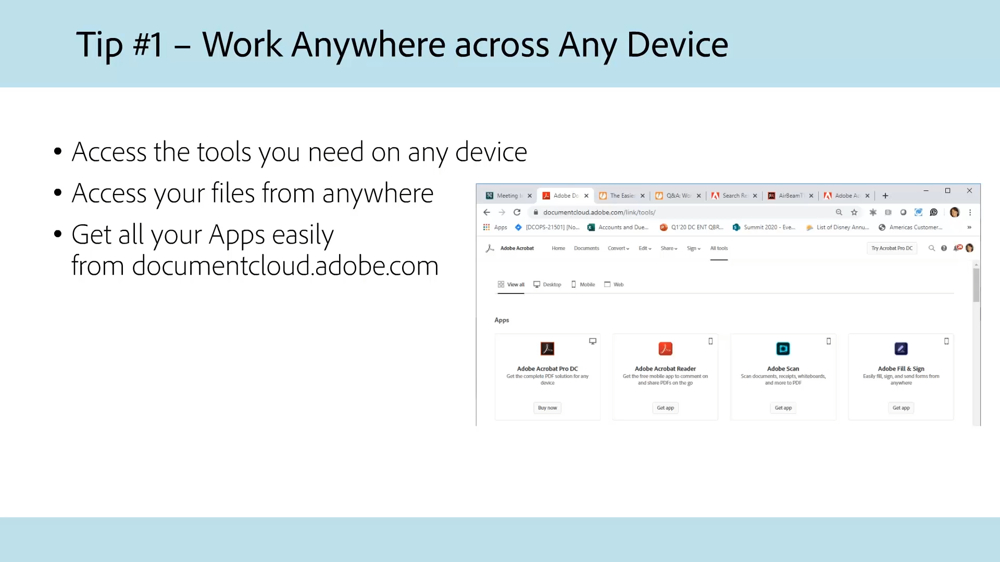
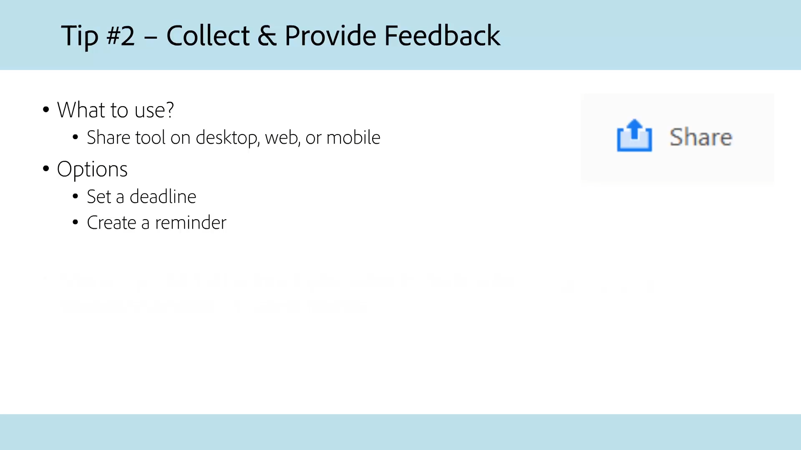
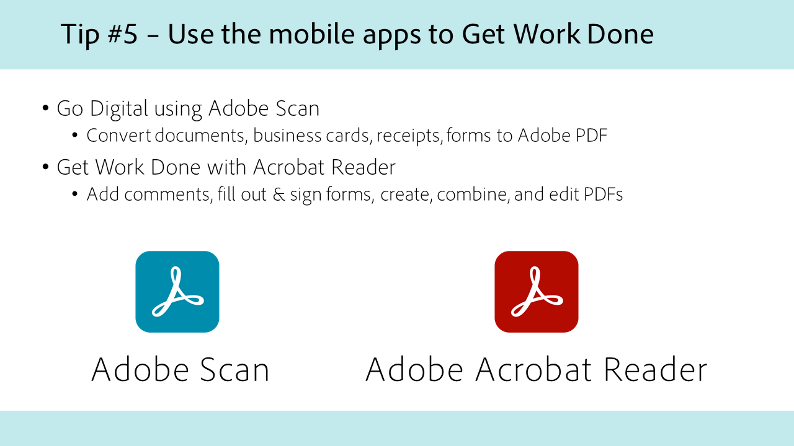
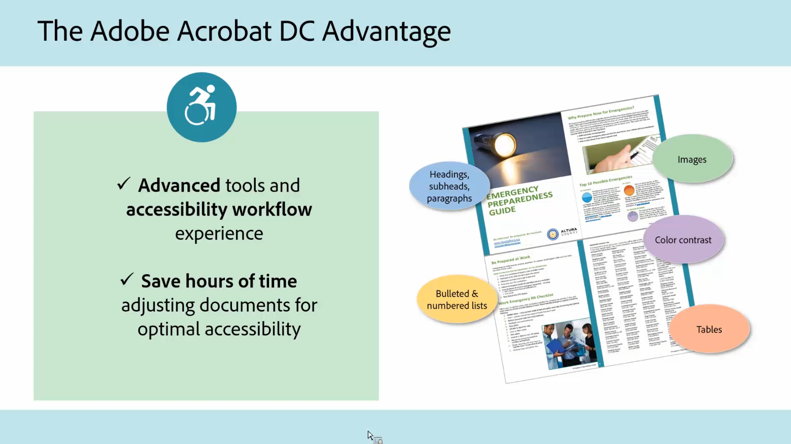

# Acrobat para la Administración Pública

Explora nuestros tutoriales de Acrobat diseñados específicamente para la administración federal, estatal y local.

## Cinco consejos para trabajar con Acrobat desde cualquier parte

<table style="table-layout:fixed">
<tr>
  <td>
    
    

    <a href="5-tips-for-working-anywhere-with-acrobat-dc-for-government.md"><strong>Cinco consejos para trabajar con Acrobat desde cualquier lugar (15:12 completo)</strong></a>
    

    <em>Aprende a usar las herramientas de Acrobat y sus aplicaciones móviles complementarias para trabajar desde cualquier parte</em>
     
  </td>
  <td>
    
    

    <a href="get-your-tools.md"><strong>Consejo 1: Consigue tus herramientas</strong></a>
    

    <em>El primer paso para empezar a trabajar desde cualquier lugar es conseguir tus herramientas de Acrobat y aplicaciones móviles complementarias</em>
     
  </td>  
  <td>
    
    

    <a href="collaborate-on-documents.md"><strong>Consejo 2: Colaborar en documentos</strong></a>
    

    <em>Crea flujos de trabajo sencillos y sin esfuerzo para colaborar en documentos</em>
     
  </td>  
</tr>
<tr>
  <td>
    
    

    <a href="protect-digital-documents.md"><strong>Consejo 3: Documentos digitales de Protect</strong></a>
    

    <em>Agregue una contraseña al PDF para evitar que se copie, edite o imprima</em>
     
  </td>
  <td>
    
    

    <a href="work-with-forms-and-signatures.md"><strong>Consejo 4: Trabajar con formularios y firmas</strong></a>
    

    <em>Descubre cómo mantenerte digital al rellenar formularios</em>
     
  </td>
  <td>
    
    

    <a href="scan-and-edit-on-mobile.md"><strong>Consejo 5: Escanea y edita en dispositivos móviles</strong></a>
    

    <em>Aprende a trabajar con Adobe Scan y las aplicaciones móviles de Acrobat Reader para trabajar desde cualquier parte</em>
     
  </td>
</tr>
</table>

## Accesibilidad

<table>
<tr>
  <td>
    
    

    <a href="making-pdfs-accessible.md"><strong>Hacer que los PDF sean accesibles (completado 14:11)</strong></a>
    

    <em>Obtenga información sobre el flujo de trabajo óptimo para crear archivos de PDF accesibles</em>
     
  </td>
  <td>
    
    

    <a href="understanding-accessibility.md"><strong>Creación de PDF accesibles: Descripción de accesibilidad</strong></a>
    

    <em>Conozca lo que significa hacer que un PDF sea accesible para personas con discapacidades</em>
     
  </td>  
  <td>
    
    

    <a href="collaborate-on-documents.md"><strong>Creación de PDF accesibles: Creación en Word</strong></a>
    

    <em>Conozca las prácticas recomendadas para crear archivos de PDF creados en [!DNL Microsoft Word]</em>
     
  </td>  
</tr>
<tr>
  <td>
    
    

    <a href="finishing-in-acrobat.md"><strong>Creación de PDF accesibles: Acabado en Acrobat</strong></a>
    

    <em>Aprenda a terminar de hacer que el archivo de PDF sea accesible mediante las herramientas de Acrobat Pro</em>
     
  </td>
  <td>
    
    

    <a href="making-pdf-ballots-accessible.md"><strong>Hacer más accesibles las papeletas de los PDF</strong></a>
    

    <em>Este seminario web abarca las áreas clave de accesibilidad de los PDF necesarias para permitir a los usuarios de tecnologías de asistencia, como lectores de pantalla, leer y completar sus votos</em>
     
  </td>  
  <td>
   
    

     
  </td>
</tr>
</table>
