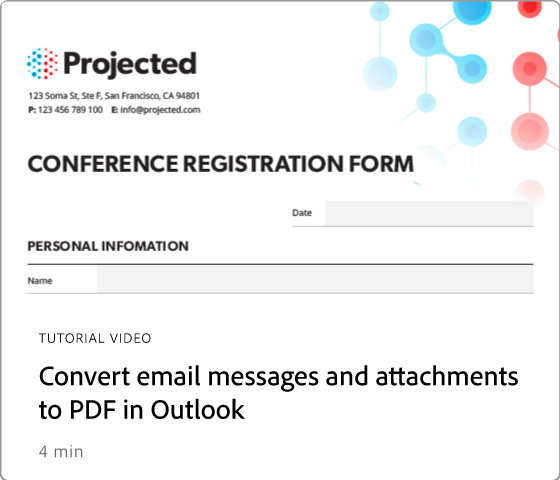

# Introducción a las integraciones

Integra Acrobat con las aplicaciones [!DNL Box], [!DNL Dropbox], [!DNL Google Drive], [!DNL OneDrive] y [!DNL Microsoft].

## Microsoft

Descubre cómo todos los miembros de tu equipo pueden trabajar sin problemas con archivos de PDF desde [Microsoft 365](https://www.adobe.com/documentcloud/integrations/microsoft-office-365.html).

<table style="table-layout:fixed">
<tr>
  <td>
    
  </td>
  <td>
    
  </td> 
  <td>
    
  </td>
  <td>
    
  </td>
</tr>
<tr>
  <td>
    
  </td>
  <td>
    
  </td>
  <td>
    
  </td>
  <td>
   
    

     
  </td>
</tr>
</table>

## Google Drive

Aprende a hacer más en menos tiempo con las herramientas esenciales de PDF y firma electrónica de [!DNL Google Drive].

<table style="table-layout:fixed">
<tr>
  <td>
    
  </td>
  <td>
   
    

     
  </td>
  <td>
   
    

     
  </td>
  <td>
   
    

     
  </td>
</tr>
</table>

## Dropbox

Obtenga información sobre lo fácil que es tener acceso a los archivos almacenados en [!DNL Dropbox] y trabajar con ellos.

<table style="table-layout:fixed">
<tr>
  <td>
    
  </td>
  <td>
   
    

     
  </td>
  <td>
   
    

     
  </td>
  <td>
   
    

     
  </td>
</tr>
</table>

## Box

Descubre cómo Acrobat y [Box](https://www.adobe.com/documentcloud/integrations/box.html){target="_blank"} hacen que sea más sencillo para todos los miembros de tu organización mantener el negocio en marcha.
