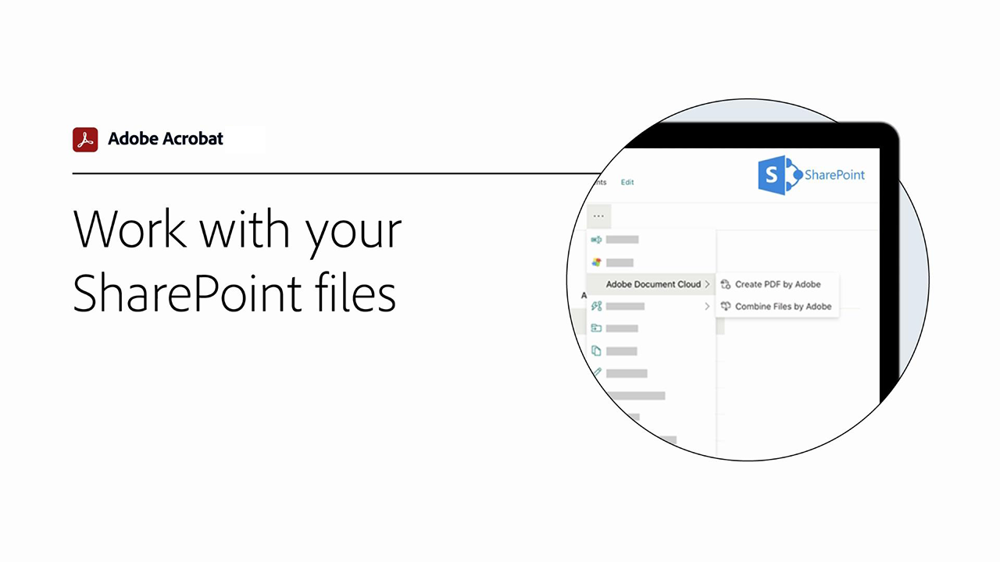
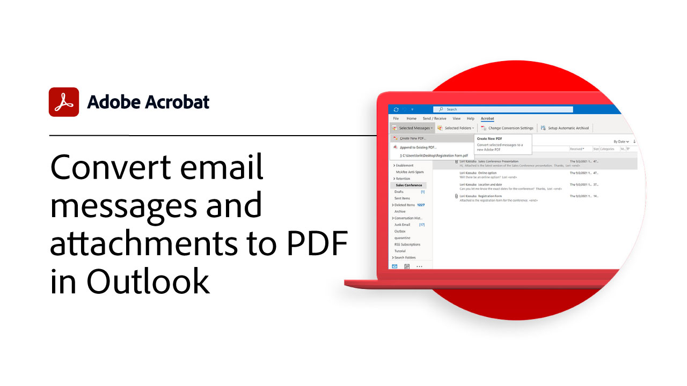
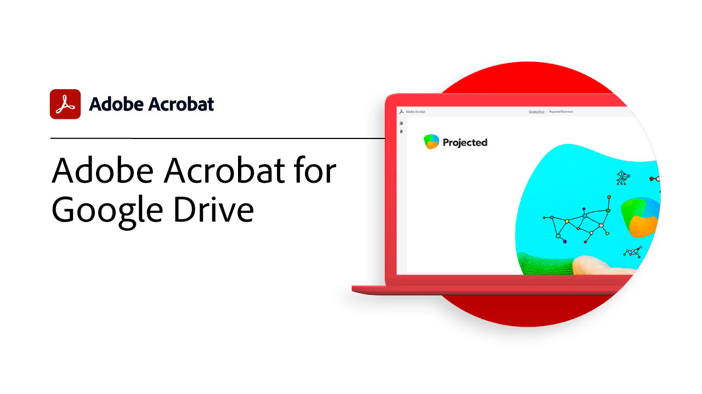

# Introducción a las integraciones

Integrar Acrobat con [!DNL Box], [!DNL Dropbox], [!DNL Google Drive], [!DNL OneDrive]y [!DNL Microsoft] aplicaciones.

## Microsoft

Descubre cómo todos los miembros de tu equipo pueden trabajar sin problemas con archivos de PDF, desde dentro [Microsoft 365](https://www.adobe.com/documentcloud/integrations/microsoft-office-365.html).

<table style="table-layout:fixed">
<tr>
  <td>
    
    

    <a href="createfromword.md"><strong>Crear archivos de PDF desde [!DNL Microsoft Word]</strong></a>
    

    <em>Cree archivos de PDF sólidos y sofisticados con tabla de contenido hipervinculada y referencias cruzadas, marcadores e incluso archivos adjuntos directamente desde [!DNL Microsoft Word]</em>
     
  </td>
  <td>
    
    

    <a href="createofficeweb.md"><strong>Crear PDF en [!DNL Office] para la web</strong></a>
    

    <em>Aprende a crear archivos de PDF sin salir de tu [!DNL Microsoft Office] para aplicaciones web</em>
     
  </td> 
  <td>
    
    

    <a href="acrobatandsp.md"><strong>Trabaja con tu [!DNL SharePoint] archivos</strong></a>
    

    <em>Agiliza los flujos de trabajo con documentos [!DNL SharePoint] y Acrobat</em>
     
  </td>
  <td>
    
    

    <a href="acrobatandteams.md"><strong>Colaboración de PDF en [!DNL Microsoft Teams]</strong></a>
    

    <em>Colabora y trabaja con tus compañeros viendo, anotando y revisando PDF sin tener que salir de aquí [!DNL Microsoft Teams]</em>
     
  </td>
</tr>
<tr>
  <td>
    
    

    <a href="outlook.md"><strong>Convertir mensajes de correo electrónico y archivos adjuntos en PDF en [!DNL Outlook]</strong></a>
    

    <em>Aprende a distribuir información de una forma más profesional y segura en [!DNL Outlook]</em>
     
  </td>
  <td>
    
    

    <a href="edge.md"><strong>Crear contenido de PDF al navegar con [!DNL Microsoft Edge]</strong></a>
    

    <em>Descubre cómo archivar páginas web en PDF sobre la marcha con la extensión de Adobe Acrobat para [!DNL Microsoft Edge]</em>
     
  </td>
  <td>
    
    

    <a href="microsoftsensitivitylabels.md"><strong>PDF de Protect con [!DNL Microsoft Purview Information] etiquetas de sensibilidad</strong></a>
    

    <em>Aprenda a proteger a los PDF añadiendo, editando, personalizando y eliminando [!DNL Microsoft Purview] etiquetas de sensibilidad directamente en Acrobat</em>
     
  </td>
  <td>
   
    

     
  </td>
</tr>
</table>

## Google Drive

Aprende a hacer más en menos tiempo con las herramientas esenciales de PDF y firma electrónica incluidas [!DNL Google Drive].

<table style="table-layout:fixed">
<tr>
  <td>
    
    

    <a href="acrobatandgoogle.md"><strong>Adobe Acrobat para [!DNL Google Drive]</strong></a>
    

    <em>Obtén acceso a herramientas de PDF que permiten ahorrar tiempo y flujos de trabajo de firma electrónica directamente en el [!DNL Google Drive] aplicación</em>
     
  </td>
  <td>
   
    

     
  </td>
  <td>
   
    

     
  </td>
  <td>
   
    

     
  </td>
</tr>
</table>

## Dropbox

Descubra lo fácil que es acceder a los archivos almacenados en [!DNL Dropbox].

<table style="table-layout:fixed">
<tr>
  <td>
    
    

    <a href="acrobat-dropbox.md"><strong>Trabajar con archivos de [!DNL Dropbox]</strong></a>
    

    <em>Aprenda a abrir, crear, editar, firmar y guardar cambios en su [!DNL Dropbox] archivos desde Acrobat</em>
     
  </td>
  <td>
   
    

     
  </td>
  <td>
   
    

     
  </td>
  <td>
   
    

     
  </td>
</tr>
</table>

## Box

Descubre cómo Acrobat y [Box](https://www.adobe.com/documentcloud/integrations/box.html){target="_blank"} haz que sea más sencillo para todos los miembros de tu organización mantener el negocio en marcha.
