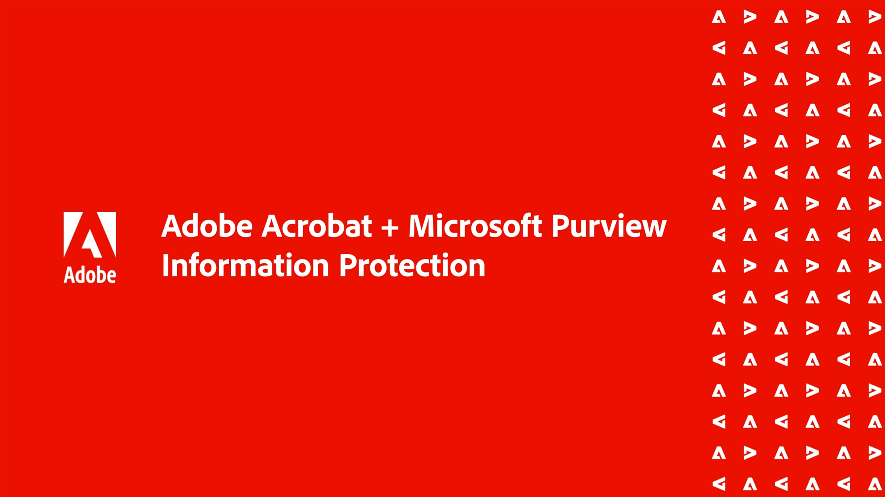

# Introducción a las integraciones

Integra Acrobat con las aplicaciones [!DNL Box], [!DNL Dropbox], [!DNL Google Drive], [!DNL OneDrive] y [!DNL Microsoft].

## Microsoft

Descubre cómo todos los miembros de tu equipo pueden trabajar sin problemas con archivos de PDF desde [Microsoft 365](https://www.adobe.com/documentcloud/integrations/microsoft-office-365.html). Echa un vistazo a esta [lista de reproducción](https://experienceleague.adobe.com/en/playlists/acrobat-integrate-microsoft-365) revisada por expertos en integraciones de Acrobat y Microsoft 365.

<table style="table-layout:fixed">
<tr>
  <td>
    
    

    <a href="createfromword.md"><strong>Crear archivos de PDF desde Microsoft Word</strong></a>
    

    Aprende a crear archivos de PDF sofisticados y sólidos directamente desde Microsoft Word
     
  </td>
  <td>
    
    

    <a href="createofficeweb.md"><strong>Crear PDF en [!DNL Office] para la web</strong></a>
    

    Aprende a crear archivos de PDF sin tener que salir de [!DNL Microsoft Office] para aplicaciones web
     
  </td> 
  <td>
    
    

    <a href="acrobatandsp.md"><strong>Trabaja con tus [!DNL SharePoint] archivos</strong></a>
    

    Agiliza los flujos de trabajo de los documentos con [!DNL SharePoint] y Acrobat
     
  </td>
  <td>
    
    

    <a href="acrobatandteams.md"><strong>Colaboración de PDF en [!DNL Microsoft Teams]</strong></a>
    

    Colaborar y revisar PDF sin salir de [!DNL Microsoft Teams]
     
  </td>
</tr>
<tr>
  <td>
    
    

    <a href="outlook.md"><strong>Convertir mensajes de correo electrónico y datos adjuntos en PDF en Outlook</strong></a>
    

    Aprende a entregar información de una manera más profesional y segura dentro de [!DNL Outlook]
     
  </td>
  <td>
    
    

    <a href="edge.md"><strong>Crear contenido de PDF mientras se navega con [!DNL Microsoft Edge]</strong></a>
    

    Aprende a convertir páginas web en PDF sobre la marcha con la extensión Adobe Acrobat para [!DNL Microsoft Edge]
     
  </td>
  <td>
    
    

    <a href="microsoftsensitivitylabels.md"><strong>PDF de Protect que usan [!DNL Microsoft Purview Information] etiquetas de sensibilidad</strong></a>
    

    Aprenda a proteger a los PDF con etiquetas de sensibilidad de Microsoft Purview Information directamente en Acrobat
     
  </td>
  <td>
   
    

     
  </td>
</tr>
</table>

## Google Drive

Aprende a hacer más en menos tiempo con las herramientas esenciales de PDF y firma electrónica de [!DNL Google Drive].

<table style="table-layout:fixed">
<tr>
  <td>
    
    

    <a href="acrobatandgoogle.md"><strong>Adobe Acrobat para Google Drive</strong></a>
    

    Aprende a obtener acceso a las herramientas de PDF que te permiten ahorrar tiempo y a los flujos de trabajo de firma electrónica directamente dentro de la aplicación [!DNL Google Drive]
     
  </td>
  <td>
   
    

     
  </td>
  <td>
   
    

     
  </td>
  <td>
   
    

     
  </td>
</tr>
</table>

## Dropbox

Obtenga información sobre lo fácil que es tener acceso a los archivos almacenados en [!DNL Dropbox] y trabajar con ellos.

<table style="table-layout:fixed">
<tr>
  <td>
    
    

    <a href="acrobat-dropbox.md"><strong>Trabajar con archivos de [!DNL Dropbox]</strong></a>
    

    Aprende a abrir, crear, editar, firmar y guardar cambios en tus archivos de [!DNL Dropbox] desde Acrobat
     
  </td>
  <td>
   
    

     
  </td>
  <td>
   
    

     
  </td>
  <td>
   
    

     
  </td>
</tr>
</table>

## Box

Descubre cómo Acrobat y [Box](https://www.adobe.com/documentcloud/integrations/box.html){target="_blank"} hacen que sea más sencillo para todos los miembros de tu organización mantener el negocio en marcha.
