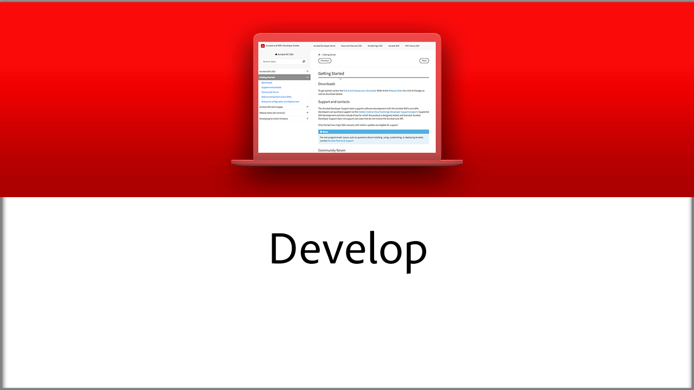
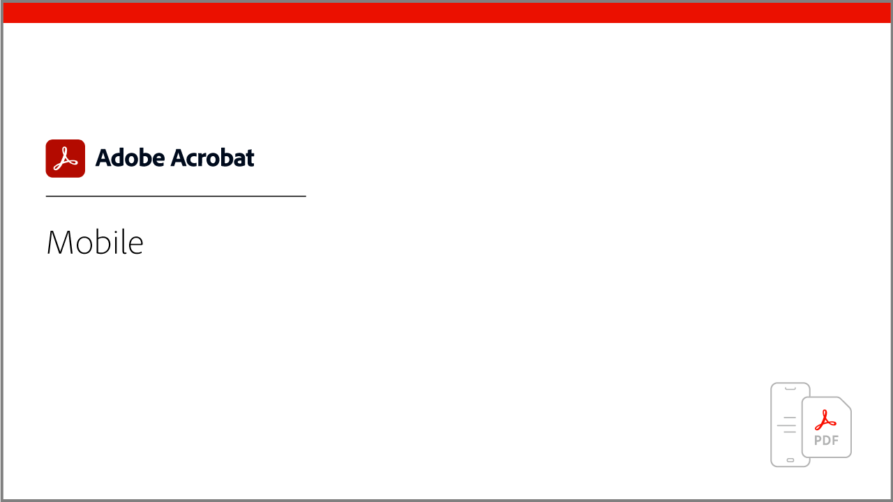

# Tutoriales de Adobe Acrobat

Adobe Acrobat, una solución de Adobe Document Cloud, ayuda a mantener el negocio en movimiento al convertir, editar, compartir y firmar archivos PDF. Aquí encontrará una amplia gama de experiencias de aprendizaje diseñadas para poner al día rápidamente a los principiantes y a los usuarios avanzados en Adobe Acrobat.

## Rutas de aprendizaje

<table style="table-layout:fixed">
<tr>
  <td>
    
    

    <a href="getting-started/getting-started-overview.md"><strong>Introducción</strong></a>
    

    <em>Obtenga información actualizada sobre cómo crear, editar, convertir, proteger y mucho más con archivos PDF</em>
     
  </td>
  <td>
    
    

    <a href="advanced-tasks/advanced-tasks-overview.md"><strong>Tareas avanzadas</strong></a>
    

    <em>Vaya más allá de los conceptos básicos con tareas específicas y automatización</em>
     
  </td>
  <td>
    
    

    <a href="skill-builder/skill-builder-overview.md"><strong>Creadores de aptitudes</strong></a>
    

    <em>Consejos basados en tareas para ayudarle a ser digital, permanecer digital y trabajar</em>
     
  </td>
</tr>
<tr>
  <td>
    
    

    <a href="integrate/integrate-overview.md"><strong>Integrar</strong></a>
    

    <em>Agregar Acrobat a sus sistemas, procesos y aplicaciones existentes</em>
     
  </td>
  <td>
    
    

    <a href="industry/industry-overview.md"><strong>Industria</strong></a>
    

    <em>Descubre cómo los negocios del mundo real se vuelven 100% digitales</em>
     
  </td>  
  <td>
    
    

    <a href="develop/develop-overview.md"><strong>Desarrollar</strong></a>
    

    <em>Obtener recursos de desarrollo en Adobe Acrobat</em>
     
  </td>
</tr>
<tr>
  <td>
    
    

    <a href="deploy/deploy-overview.md"><strong>Implementar</strong></a>
    

    <em>Información y prácticas recomendadas para implementar Acrobat en su organización</em>
     
  </td>
  <td>
    
    

    <a href="mobile/mobile-overview.md"><strong>Dispositivos móviles</strong></a>
    

    <em>Crear, rellenar y firmar archivos PDF en el dispositivo móvil</em>
     
  </td>  
  <td>
   
    

     
  </td>
</tr>
</table>
