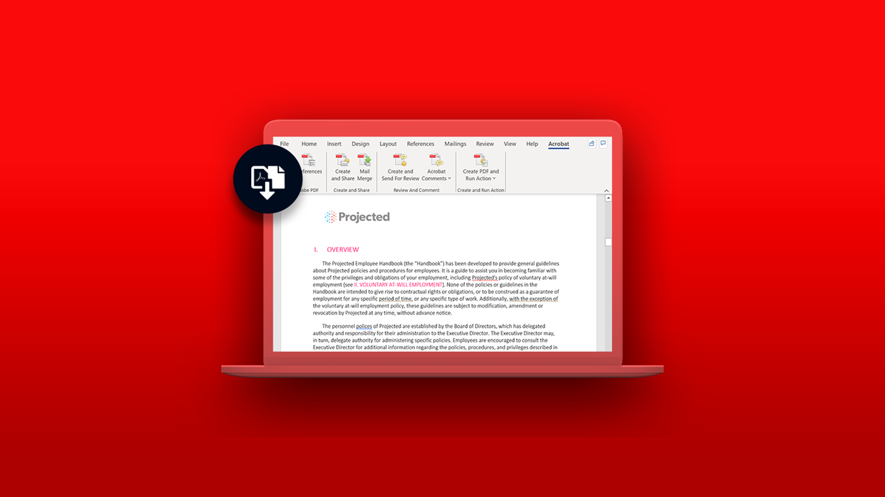

# Tutoriales de Acrobat

Adobe Acrobat, una solución de Adobe Document Cloud, ayuda a que las tareas no se detengan al convertir, editar, compartir y firmar PDF. Aquí puede encontrar una amplia gama de experiencias de aprendizaje diseñadas para poner al día rápidamente a los usuarios principiantes y avanzados en Adobe Acrobat.

## Rutas de aprendizaje destacadas

<table style="table-layout:fixed">
<tr>
 <td>
    
    

    <a href="getting-started/getting-started-overview.md"><strong>Introducción</strong></a>
    

    Obtén información actualizada sobre cómo crear, editar, convertir, proteger y mucho más con archivos de PDF
     
  </td>
  <td>
    
    

    <a href="advanced-tasks/advanced-tasks-overview.md"><strong>Tareas avanzadas</strong></a>
    

    Ve más allá de lo básico con tareas específicas y automatización
     
  </td>
  <td>
    
  

    <a href="60-second/60-second-overview.md"><strong>Acrobat de 60 segundos</strong></a>
    

    Tutoriales del tamaño de una mordida para ayudarte a aprender un nuevo truco en Acrobat en un minuto o menos
     
  </td>
</tr>
  <td>
    
    

    <a href="integrate/integrate-overview.md"><strong>Integraciones</strong></a>
    

    Añada Acrobat a aplicaciones existentes como Microsoft, Google Drive, Dropbox y Box
     
  </td>
  <td>
    
    

     
  </td>
  <td>
    
    

     
  </td>
</tr>
</table>
