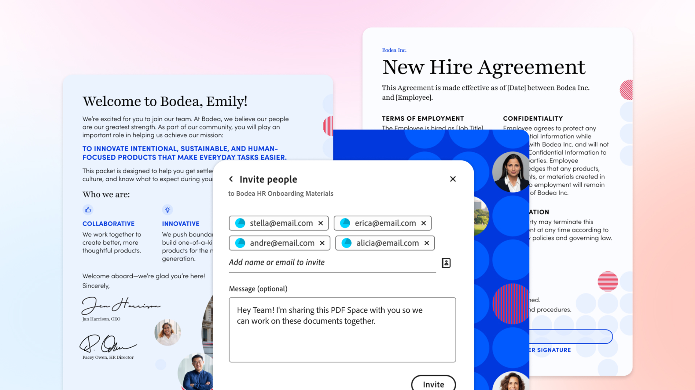

# Introducción a los casos prácticos

Descubre cómo puedes usar Acrobat para aumentar la productividad y convertir la información en información procesable para tu equipo y el sector.

## Línea de negocio

Descubre cómo los equipos de diferentes líneas de negocio utilizan Acrobat para resolver los desafíos diarios de los documentos, optimizar los flujos de trabajo y respaldar el trabajo esencial para la empresa.

<table style="table-layout:fixed">
<tr>
  <td>
    
    

    <a href="lob/finance/finance-overview.md"><strong>Casos prácticos de finanzas</strong></a>
    

    <em>Descubre cómo los equipos de finanzas usan Acrobat para crear, administrar, analizar y proteger documentos financieros</em>
     
  </td>
  <td>
    
    

    <a href="lob/hr/hr-overview.md"><strong>Casos prácticos de HR</strong></a>
    

    <em>Descubre cómo los equipos de RR. HH. usan Acrobat para gestionar documentos y flujos de trabajo en el ciclo de vida de los empleados</em>
     
  </td>
  <td>
    
    

    <a href="lob/sales/sales-overview.md"><strong>Casos prácticos de ventas</strong></a>
    

    <em>Descubre cómo los equipos de ventas pasan de la información al impacto con una colaboración más inteligente y una creación de contenido más rápida.</em>
     
  </td>
  <td>
        
        

         
  </td>
</tr>
</table>

## Industria

<!-- START CARDS HTML - DO NOT MODIFY BY HAND -->

    

        

            

                <figure class="image x-is-16by9">
                    
                </figure>
            

            

                

                    

                        <a href="https://experienceleague.adobe.com/en/docs/document-cloud-learn/acrobat-learning/use-cases/gov/gov-overview" target="_self" rel="referrer" title="Acrobat para la Administración Pública">Acrobat para el gobierno</a>
                    

                    
Explora nuestros tutoriales de Acrobat diseñados específicamente para la administración federal, estatal y local

                

                <a href="https://experienceleague.adobe.com/en/docs/document-cloud-learn/acrobat-learning/use-cases/gov/gov-overview" target="_self" rel="referrer" class="spectrum-Button spectrum-Button--outline spectrum-Button--primary spectrum-Button--sizeM" style="align-self: flex-start; margin-top: 1rem;">
                    Explorar tutoriales
                </a>
            

        

    

<!-- END CARDS HTML - DO NOT MODIFY BY HAND -->