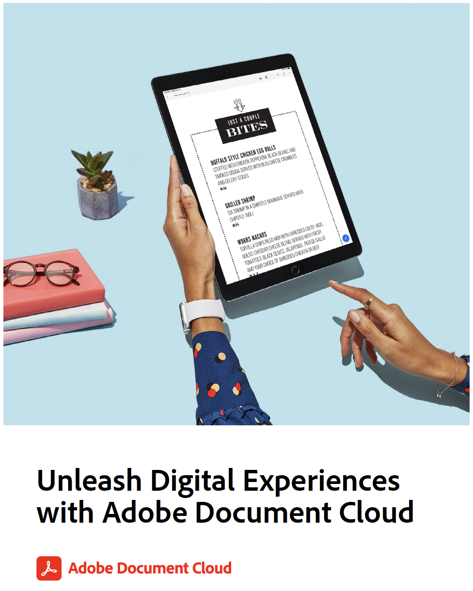

# Ejercicios para dar rienda suelta a las experiencias digitales con Adobe Document Cloud

Este documento contiene más ejercicios y una revisión de los flujos de trabajo cubiertos. A continuación se muestran los archivos de demostración que utilizamos en los siguientes ejercicios. Cada ejercicio también vuelve a mostrar este contenido:

* Ex.1: Digitalice cualquier formulario: use sus propias tarjetas de visita, recibo u otro documento en papel
* [Ex.2: Rellenar y firmar cualquier formulario](assets/03_FillSignScan.zip)
* [Ejemplo 3: Compartir archivos de PDF y revisarlos en línea](assets/01_Review.zip)
