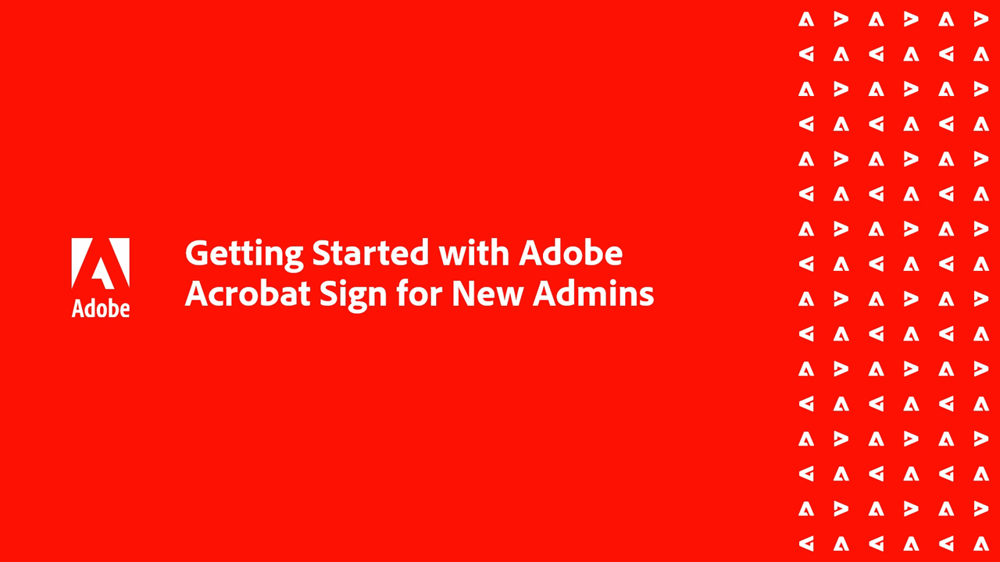
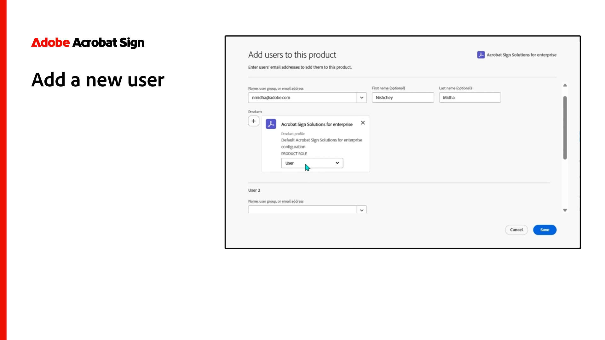
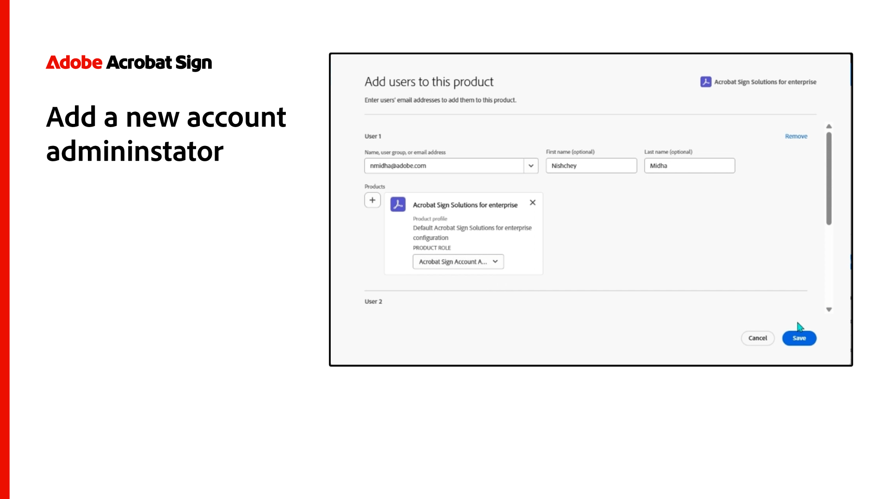
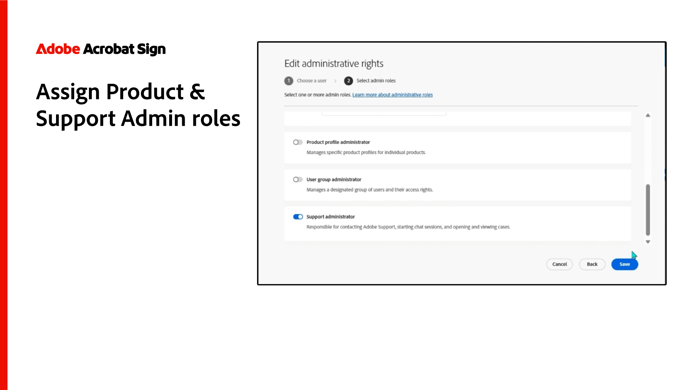

# Introducción a Administradores

Obtenga más información sobre cómo añadir usuarios a su cuenta, configurar grupos, compartir acceso y configurar un flujo de trabajo, un archivo externo y eventos y alertas compartidos. Estos tutoriales están diseñados para administradores que han pasado la fase de instalación y están listos para comenzar a administrar Acrobat Sign. Las Tareas avanzadas cubren temas que se expanden más allá de la configuración del administrador y pasan a definir la configuración global, el acceso y uso compartido de la cuenta y el etiquetado de texto.

## Novedades

>[!BEGINTABS]

>[!TAB Agregar un nuevo usuario]

Obtenga información sobre cómo [agregar nuevos usuarios a Acrobat Sign](add-users-to-your-account.md).

>[!TAB Cómo configurar los administradores de privacidad]

Obtenga información sobre cómo configurar y usar [administradores de privacidad](privacy.md).

>[!TAB Herramienta de descarga masiva]

Aprende a usar la [herramienta de descarga masiva](bulk-download-tool.md) para descargar rápidamente todos tus acuerdos firmados.

>[!ENDTABS]

## Introducción

<table style="table-layout:fixed">
<tr>
  <td>
    
    

    <a href="get-started-admin.md"><strong>Introducción para nuevos administradores</strong></a>
    

    <em>En esta completa guía de vídeo, aprende todas las herramientas necesarias para poner en marcha tu organización con Acrobat Sign</em>
     
  </td>
  <td>
    
    

    <a href="up-and-running-admin.md"><strong>Activo y en ejecución para administradores</strong></a>
    

    <em>Descripción general de 7 áreas clave para que los administradores se pongan en marcha rápidamente en Acrobat Sign</em>
     
  </td>
  <td>
    
    

    <a href="set-up-shared-events-and-alert.md"><strong>Configurar notificaciones de eventos y alertas</strong></a>
    

    <em>Configurar notificaciones de eventos y alertas para tu cuenta</em>
     
  </td>
  <td>
    
    

    <a href="add-users-to-your-account.md"><strong>Agregar un nuevo usuario</strong></a>
    

    <em>Obtener información sobre cómo agregar nuevos usuarios a Acrobat Sign</em>
     
  </td>
</tr>
<tr>
 <td>
    
    

    <a href="add-admin.md"><strong>Agregar un nuevo administrador de cuentas</strong></a>
    

    <em>Aprenda a crear un nuevo usuario o a ascender a un usuario existente a la función de administrador de Acrobat Sign</em>
     
  </td>
  <td>
    
    

    <a href="create-and-manage-groups.md"><strong>Creación y administración de grupos</strong></a>
    

    <em>Crear grupos, agregar usuarios a grupos y modificar la configuración de los grupos</em>
     
  </td>
  <td>
    
    

    <a href="set-up-your-external-archive.md"><strong>Configurando un archivo externo</strong></a>
    

    <em>Crear un archivo externo para copias de seguridad de los acuerdos firmados</em>
     
  </td>
  <td>
    
    

    <a href="../sign-advanced-users/create-a-template.md"><strong>Creando una plantilla de documento</strong></a>
    

    <em>Crea una plantilla de documento reutilizable para agilizar y mantener la coherencia</em>
     
  </td>
</tr>
<tr>
  <td>
    
    

    <a href="../sign-advanced-users/creating-a-report.md"><strong>Uso de informes y transacciones</strong></a>
    

    <em>Obtener información sobre cómo generar informes y realizar un seguimiento del uso de transacciones</em>
     
  </td>
  <td>
    
    

    <a href="report-options.md"><strong>Opciones de informes para usuarios</strong></a>
    

    <em>Obtener información sobre cómo configurar las opciones de informes para los usuarios</em>
     
  </td>
  <td>
    
    

    <a href="../sign-advanced-users/webform.md"><strong>Creando un formulario web</strong></a>
    

    <em>Crea un documento que se pueda firmar electrónicamente directamente en tu sitio web</em>
     
  </td>
  <td>
    
    

    <a href="../sign-advanced-users/modify-webform.md"><strong>Modificar un formulario web existente</strong></a>
    

    <em>Obtenga información sobre cómo deshabilitar, editar y volver a habilitar un formulario web existente</em>
     
  </td>
</tr>
<tr>
  <td>
    
    

    <a href="../sign-advanced-users/megasign.md"><strong>Enviar en bloque</strong></a>
    

    <em>Recopila miles de firmas a la vez para cualquier documento</em>
     
  </td>
  <td>
    
    

    <a href="building-a-custom-workflow.md"><strong>Configurando un flujo de trabajo</strong></a>
    

    <em>Automatiza los flujos de trabajo de los documentos para obtener rápidamente firmas electrónicas y datos</em>
     
  </td>
  <td>
    
    

    <a href="audit-reports.md"><strong>Informes de auditoría</strong></a>
    

    <em>Aprende a acceder, utilizar y configurar informes de auditoría</em>
     
  </td>
  <td>
    
    

    <a href="promote-admin.md"><strong>Asignar funciones de administrador de productos y asistencia</strong></a>
    

    <em>Aprenda a asignar una función de administrador de productos y administrador de asistencia de usuario de Acrobat Sign en el Admin Console</em>
     
  </td>
</tr> 
</table>

## Tareas avanzadas

<table style="table-layout:fixed">
<tr>
  <td>
    
    

    <a href="learn-about-global-settings.md"><strong>Configuración global</strong></a>
    

    <em>Edita la configuración de productos de forma global para toda tu organización o para grupos específicos</em>
     
  </td>
  <td>
      
    

    <a href="share-account-access.md"><strong>Acceso compartido a la cuenta</strong></a>
    

    <em>Configurar el acceso de solo lectura a las transacciones en la cuenta de otro usuario</em>
     
  </td>
  <td>
    
    

    <a href="advanced-account-sharing.md"><strong>Uso compartido avanzado de la cuenta</strong></a>
    

    <em>Configurar el uso compartido de cuentas para permitir a los administradores y usuarios delegar sus permisos de envío, modificación y visualización</em>
     
  </td>
  <td>
    
    

    <a href="bulk-download-tool.md"><strong>Herramienta de descarga masiva</strong></a>
    

    <em>Aprende a usar la herramienta de descarga masiva para descargar rápidamente todos tus acuerdos firmados</em>
     
  </td> 
</tr>
<tr>
   <td>
     
    

    <a href="../sign-advanced-users/adobe-sign-text-tagging.md"><strong>Etiquetado de texto de Acrobat Sign</strong></a>
    

    <em>Crear campos de formulario de Acrobat Sign mediante el etiquetado de texto con Adobe Acrobat</em>
     
  </td>
  <td>
    
    

    <a href="use-bio-pharma-settings.md"><strong>Usar configuración de biofarmacéutica</strong></a>
    

    <em>Configurar opciones de biofarmacéutica que le permitan cumplir con los requisitos de la FDA 21 CFR Parte 11</em>
     
  </td>
  <td>
    
    

    <a href="privacy.md"><strong>Cómo configurar los administradores de privacidad</strong></a>
    

    <em>Obtener información sobre cómo configurar y usar administradores de privacidad</em>
     
  </td>
  <td>
    
    

     
  </td>
</tr>
</table>
