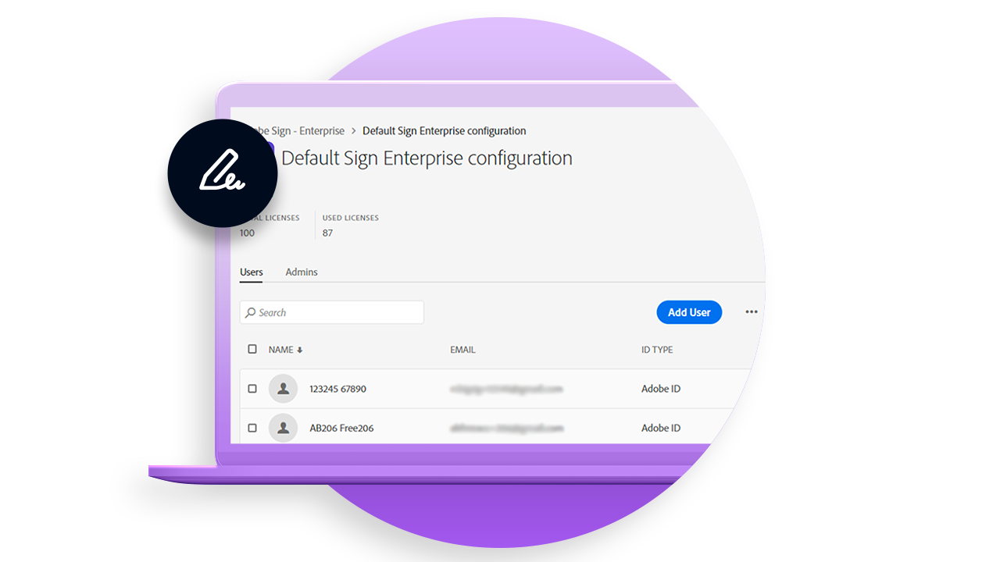
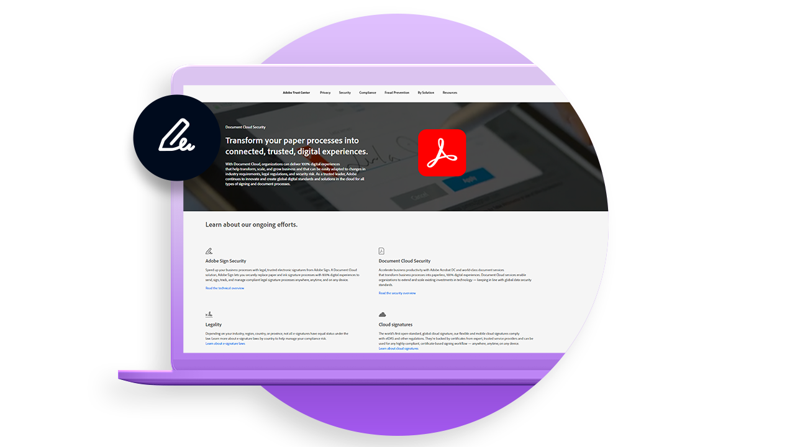
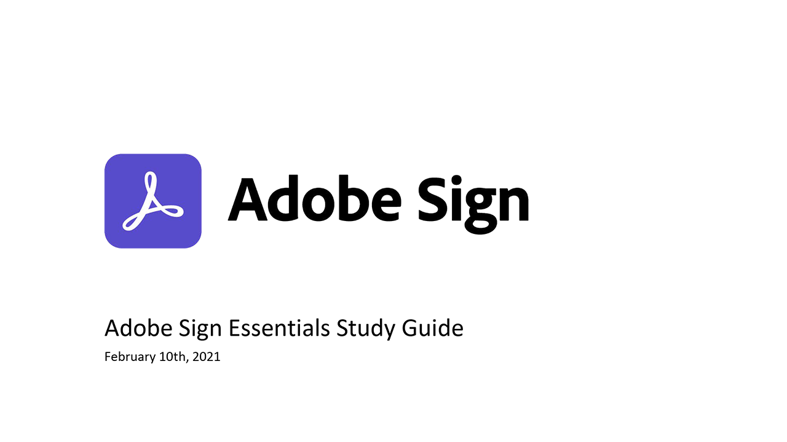

# Introducción a la implementación

Artículos con información valiosa y prácticas recomendadas sobre la implementación de Acrobat Sign en su organización.

<table style="table-layout:fixed">
<tr>
  <td>
    
    

    <a href="https://helpx.adobe.com/es/enterprise/using/adobe-sign-for-enterprise.html" target="_blank"><strong>Administrar Acrobat Sign en el Admin Console</strong></a>
    

    <em>Aprende a administrar usuarios y licencias de Acrobat Sign en la plataforma empresarial de Adobe en Adobe Admin Console</em>
     
  </td>
  <td>
    
    

    <a href="https://www.adobe.com/trust/document-cloud-security.html" target="_blank"><strong>Centro de confianza de Adobe</strong></a>
    

    <em>Más información sobre nuestros esfuerzos en seguridad, legalidad y estándares para Acrobat Sign</em>
     
  </td>
  <td>
    
    

    <a href="assets/SignStudyGuide.pdf"><strong>Guía de estudio de Acrobat Sign Essentials</strong></a>
    

    <em>Guía de estudio de Acrobat Sign para la evaluación de aspectos esenciales de Acrobat Sign (AD3-D104)</em>
     
  </td>
  <td>
    
    

     
  </td>
</tr>
</table>
