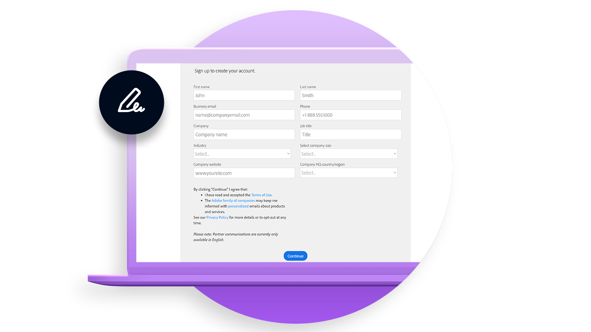
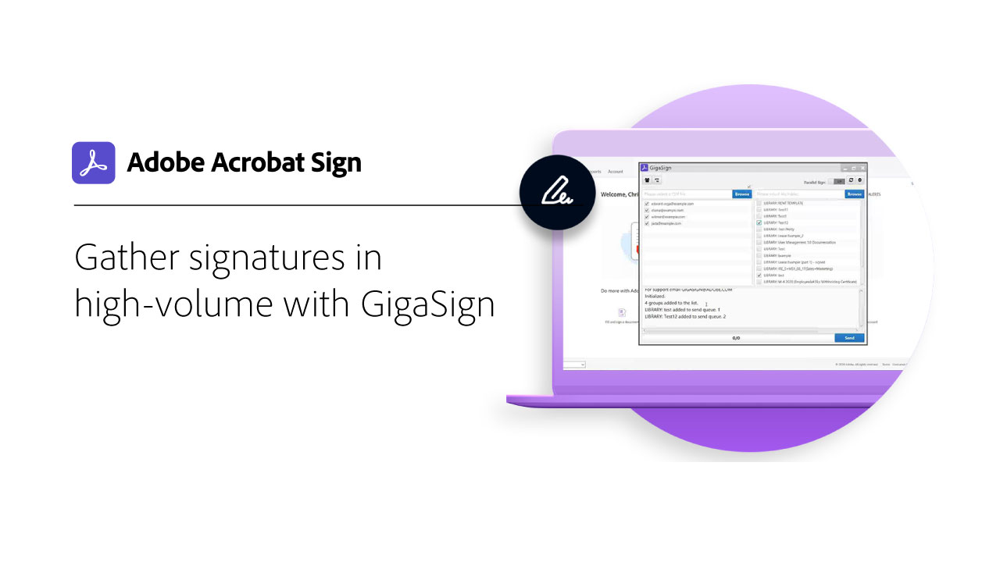
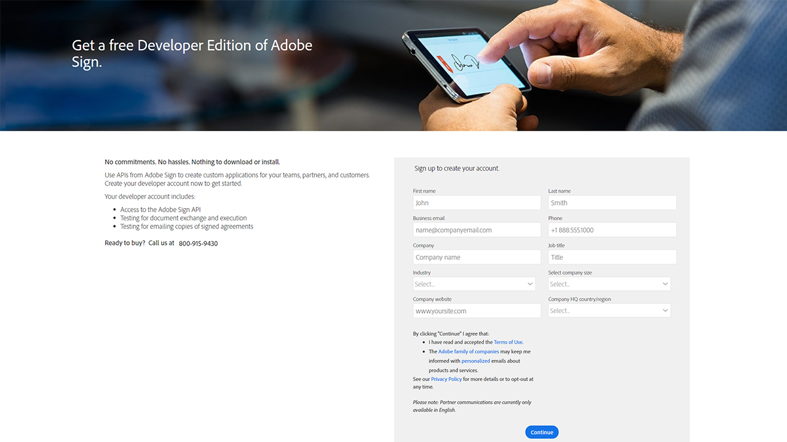
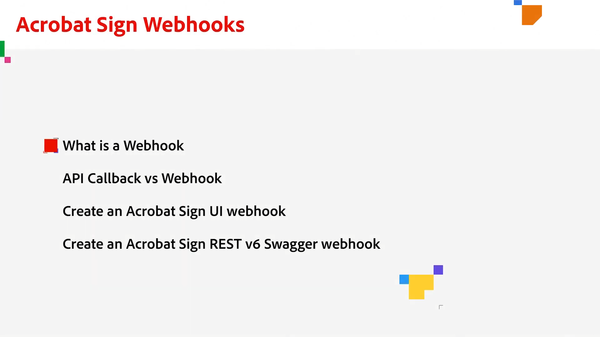

# Desarrollar información general

El 40 % de los acuerdos en Acrobat Sign se crean mediante API. Utiliza las API para crear aplicaciones personalizadas para tus equipos, partners y clientes.

## Novedades

>[!BEGINTABS]

>[!TAB Cómo configurar webhooks]

Aprende a crear un [webhook](webhooks.md) para automatizar procesos que normalmente requerirían intervención manual.

>[!ENDTABS]

<table style="table-layout:fixed">
<tr>
  <td>
    
    

    <a href="https://www.adobe.io/apis/documentcloud/sign.html" target="_blank"><strong>Crear una cuenta de desarrollador</strong></a>
    

    <em>Obtener información sobre cómo comenzar a usar una cuenta de desarrollador</em>
     
  </td>
  <td>
    
    

    <a href="https://www.adobe.io/apis/documentcloud/sign/docs.html" target="_blank"><strong>Descubre lo que puedes hacer</strong></a>
    

    <em>Descubre cómo puedes incorporar la funcionalidad de Acrobat Sign en cualquier aplicación externa</em>
     
  </td>  
  <td>
    
    

    <a href="gigasign.md"><strong>Recopilar documentos de gran volumen mediante GigaSign</strong></a>
    

    <em>Envía, recopila y realiza el seguimiento de documentos para su firma a miles de personas al mismo tiempo</em>
     
  </td>
   <td>
    
    

    <a href="embeddedesignature.md"><strong>Crear firmas electrónicas incrustadas y experiencias con documentos</strong></a>
    

    <em>Aprende a usar las API de Acrobat Sign para insertar firmas electrónicas y experiencias de documentos en tus plataformas web y sistemas de gestión de documentos y contenido</em>
     
  </td>
</tr>
<tr>
  <td>
    
    

    <a href="webhooks.md"><strong>Cómo configurar webhooks</strong></a>
    

    <em>Aprende a crear un webhook para automatizar procesos que normalmente requieren intervención manual</em>
     
  </td>
  <td>
    
    

     
  </td>
  <td>
    
    

     
  </td>
  <td>
    
    

     
  </td>
</tr>
</table>
