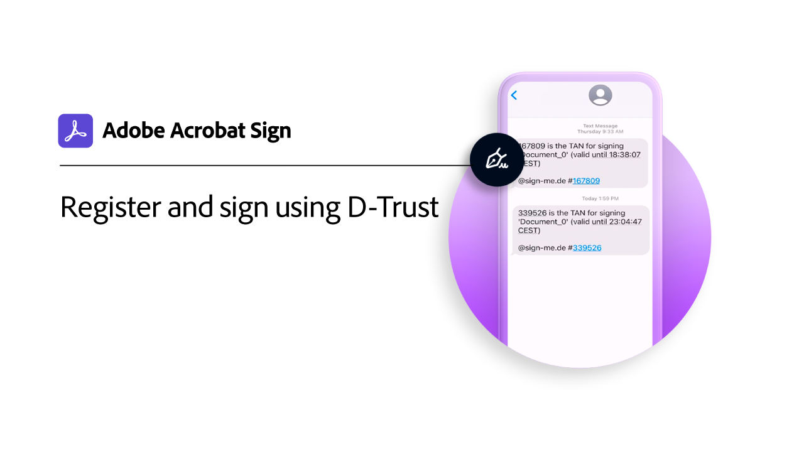
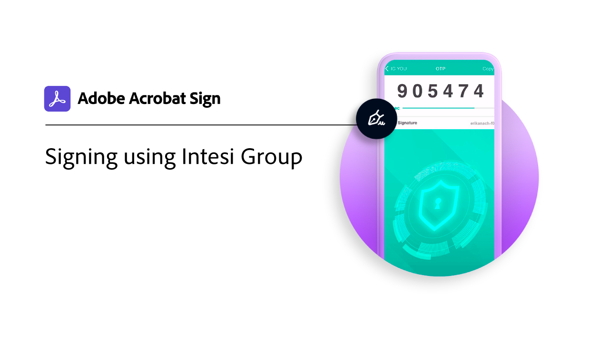

# Introducción al ID digital

Al igual que un pasaporte en formato electrónico, una identidad digital (ID digital) le permite probar de forma segura que es quien dice ser. Además, al firmar electrónicamente en Acrobat Sign, el uso de un ID digital proporciona un mayor nivel de seguridad de que has autorizado tu firma electrónica en ese documento específico. Los siguientes tutoriales muestran cómo utilizar ID digitales de todo el mundo con Acrobat Sign.

>[!NOTE]
>
>Antes de poder utilizar un ID digital con una firma en la nube, consulte al administrador de su organización para confirmar que la solución del proveedor está habilitada en Acrobat Sign.

## Novedades

* [Registrar y firmar con Digidentity](digidentity-sign.md)
Aprende a registrarte y usar tu ID digital de [!DNL Digidentity] con Acrobat Sign
* [Registrar y firmar con D-Trust](d-trust.md)
Aprende a registrar tu identidad con [!DNL D-Trust] y, a continuación, usa la firma digital de [!DNL D-Trust] en un documento de Acrobat Sign

## [!DNL Aadhaar]

<table style="table-layout:fixed">
<tr>
 <td>
    
    

    <a href="aadhaar-sign.md"><strong>Firmar usando [!DNL Aadhaar]</strong></a>
    

    <em>Descubre cómo usar tu ID digital de [!DNL Aadhaar] con Acrobat Sign</em>
     
  </td>
  <td>
    
    

     
  </td>
  <td>
    
    

     
  </td>
  <td>
    
    

     
  </td>
</tr>
</table>

## [!DNL Digidentity]

<table style="table-layout:fixed">
<tr>
  <td>
    
    

    <a href="digidentity-sign.md"><strong>Registrar y firmar con [!DNL Digidentity]</strong></a>
    

    <em>Descubre cómo registrarte y usar tu ID digital de [!DNL Digidentity] con Acrobat Sign</em>
     
  </td>
  <td>
    
    

     
  </td>
  <td>
    
    

     
  </td>
  <td>
    
    

     
  </td>
</tr>
</table>

## [!DNL D-Trust]

<table style="table-layout:fixed">
<tr>
  <td>
    
    

    <a href="d-trust.md"><strong>Registrar y firmar con D-Trust</strong></a>
    

    <em>Aprende a registrar tu identidad con [!DNL D-Trust] y luego usa la firma digital de [!DNL D-Trust] en un documento de Acrobat Sign</em>
     
  </td>
  <td>
    
    

     
  </td>
  <td>
    
    

     
  </td>
  <td>
    
    

     
  </td>
  </tr>
  </table>

## [!DNL Intesi Group]

<table style="table-layout:fixed">
<tr>
  <td>
    
    

    <a href="intesi-advanced.md"><strong>Obtener un id. digital de [!DNL Intesi Group] (avanzado)</strong></a>
    

    <em>Obtener información sobre cómo obtener un certificado de firma digital avanzada de [!DNL Intesi Group]</em>
     
  </td>
  <td>
    
    

    <a href="intesi-qualified.md"><strong>Obtener un id. digital de [!DNL Intesi Group] (calificado)</strong></a>
    

    <em>Obtener información sobre cómo obtener un certificado de firma digital cualificado de [!DNL Intesi Group]</em>
     
  </td>
  <td>
    
    

    <a href="intesi-sign.md"><strong>Firmar usando [!DNL Intesi Group]</strong></a>
    

    <em>Descubre cómo usar tu ID digital de [!DNL Intesi Group] con Acrobat Sign</em>
     
  </td>
  <td>
    
    

     
  </td>
</tr>
</table>
