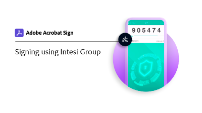

# Obtener un ID digital de [!DNL Intesi Group] (Cualificado)

Obtenga información sobre cómo obtener un certificado de firma digital cualificado de [!DNL Intesi Group]. Una vez registrado y verificada su identidad, [!DNL Intesi Group] proporciona un ID digital que se utiliza para aplicar una firma en la nube de Acrobat Sign.

>[!VIDEO](https://video.tv.adobe.com/v/337064?quality=12&learn=on&hidetitle=true)

  

**Seleccione la siguiente imagen para aprender a utilizar su [!DNL Intesi Group] ID digital en Acrobat Sign.**

