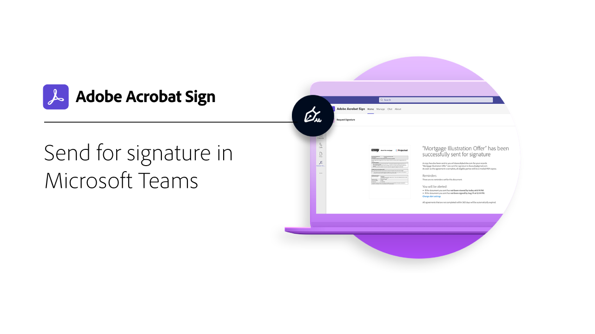

# Introducción a las integraciones

Puede utilizar Acrobat Sign dentro de otras aplicaciones que su organización ya utiliza, como Microsoft, Salesforce, Workday y Marketo, por nombrar algunas. Aprenda a simplificar los flujos de trabajo de firma electrónica en estas guías y tutoriales de integración.

>[!NOTE]
> Si tiene problemas para acceder a cualquiera de estas funciones, consulte al administrador de su organización para asegurarse de que la integración esté activada.

## Novedades

* [Microsoft Dynamics 365 for Field Service](dynamics-field-service.md)
Descubre cómo Acrobat Sign, [!DNL Power Automate], y [!DNL Microsoft Dynamics 365] de Field Service se utilizan para agilizar las interacciones in situ con los clientes
* [Microsoft Dynamics 365 for Customer Service](dynamics-customer-service.md)
Descubre cómo Acrobat Sign y [!DNL Microsoft Dynamics 365] para el servicio de atención al cliente se utilizan para mejorar la satisfacción del cliente en un portal web de cliente de autoservicio
* [Integrar un formulario web con [!DNL SharePoint] Online](integrate-web-form-sharepoint-online.md)
Aprenda a asignar los datos recopilados de un formulario web a un [!DNL SharePoint] lista

## Tutoriales de integraciones de Microsoft

<table style="table-layout:fixed">
<tr>
  <td>
    
    

    <a href="fill-and-sign-doc-microsoft-outlook.md"><strong>Rellenar y firmar en Microsoft Outlook</strong></a>
    

    <em>Rellenar y firmar un formulario directamente desde Microsoft Outlook</em>
     
  </td>
  <td>
    
    

    <a href="send-for-signature-with-outlook.md"><strong>Enviar para firmar en Outlook</strong></a>
    

    <em>Enviar un documento para su firma directamente en Microsoft Outlook</em>
     
  </td>
  <td>
    
    

    <a href="send-for-signature-with-sharepoint-online.md"><strong>Enviar para firmar en SharePoint Online</strong></a>
    

    <em>Enviar un documento para su firma directamente en SharePoint Online</em>
     
  </td>
   <td>
    
    

    <a href="track-an-agreement-with-sharepoint-online.md"><strong>Seguimiento en SharePoint Online</strong></a>
    

    <em>Seguimiento del progreso de un acuerdo directamente desde Microsoft Sharepoint</em>
     
  </td>
</tr>
<tr>
  <td>
    
    

    <a href="integrate-web-form-sharepoint-online.md"><strong>Integrar un formulario web con [!DNL SharePoint Online]</strong></a>
    

    <em>Aprenda a asignar los datos recopilados de un formulario web a un [!DNL SharePoint] lista</em>
     
  </td>
  <td>
    
    

    <a href="auto-archive-sharepoint-power-automate.md"><strong>Archivado automático de archivos en [!DNL SharePoint] con [!DNL Power Automate]</strong></a>
    

    <em>Aprenda a archivar automáticamente documentos firmados en un [!DNL SharePoint] biblioteca con [!DNL Power Automate]</em>
     
  </td>
  <td>
    
    

    <a href="documentautomation.md"><strong>Automatización de documentos con [!DNL Acrobat Sign for Microsoft Power Platform]</strong></a>
    

    <em>Obtenga información sobre cómo activar y utilizar la [!DNL Acrobat Sign] y [!DNL Adobe PDF Tools] conectores para [!DNL Microsoft Power] aplicaciones</em>
     
  </td>
   <td>
    
    

    <a href="adobe-sign-teams-mortgage.md"><strong>Enviar para firmar en [!DNL Microsoft Teams]</strong></a>
    

    <em>Envía documentos para su firma directamente en [!DNL Microsoft Teams]</em>
     
  </td>
</tr>
<tr>
  <td>
    
    

    <a href="dynamics-customer-service.md"><strong>Microsoft Dynamics 365 for Customer Service</strong></a>
    

    <em>Descubre cómo Acrobat Sign y [!DNL Microsoft Dynamics 365] para el servicio de atención al cliente se utilizan para mejorar la satisfacción del cliente en un portal web de cliente de autoservicio</em>
     
  </td>
  <td>
    
    

    <a href="dynamics-field-service.md"><strong>Microsoft Dynamics 365 for Field Service</strong></a>
    

    <em>Descubre cómo Acrobat Sign, [!DNL Power Automate], y [!DNL Microsoft Dynamics 365] de Field Service se utilizan para agilizar las interacciones in situ con los clientes</em>
     
  </td>
  <td>
    
    

     
  </td>
  <td>
    
    

     
  </td>
</tr>
</table>

## [!DNL Notarize] tutoriales de integración

<table style="table-layout:fixed">
<tr>
  <td>
    
    

    <a href="send-document-notarize.md"><strong>Enviar documentos para su notarización</strong></a>
    

    <em>Obtenga información sobre cómo enviar un documento para su notarización</em>
     
  </td>
  <td>
    
    

     
  </td>
  <td>
    
    

     
  </td>
  <td>
    
    

     
  </td>
</tr>
</table>

## Tutoriales de integraciones de Salesforce

<table style="table-layout:fixed">
<tr>
  <td>
    
    

    <a href="create-an-agreement-template.md"><strong>Document Builder para [!DNL Salesforce]</strong></a>
    

    <em>Aprenda a crear una plantilla de documento reutilizable mediante el Generador de documentos para [!DNL Salesforce]</em>
     
  </td>
  <td>
    
    

    <a href="set-up-data-mapping.md"><strong>Configuración de la asignación de datos</strong></a>
    

    <em>Recuperar datos en Salesforce después de firmar un acuerdo</em>
     
  </td>
  <td>
    
    

    <a href="set-up-merging-map.md"><strong>Configuración de la asignación de combinación en Salesforce</strong></a>
    

    <em>Aprenda a combinar datos de Salesforce directamente en un documento de Acrobat Sign</em>
     
  </td>
  <td>
    
    

    <a href="create-a-custom-button.md"><strong>Creación de un botón personalizado</strong></a>
    

    <em>Crear un botón personalizado que inicie el proceso de envío y rellene automáticamente un acuerdo dentro de Salesforce</em>
     
  </td>
</tr>
</table>

## Tutoriales de integración de Workday

<table style="table-layout:fixed">
<tr>
 <td>
    
    

    <a href="acrobat-sign-workday-onboarding.md"><strong>Contratación de nuevos empleados de Acrobat Sign y Workday</strong></a>
    

    <em>Descubre cómo optimizar los flujos de trabajo de incorporación con Acrobat Sign y Workday</em>
     
  </td>
 <td>
    
    

     
  </td>
  <td>
    
    

     
  </td>
  <td>
    
    

     
  </td>
</tr>
</table>

## Tutoriales de integración y guías de configuración de Marketo

<table style="table-layout:fixed">
<tr>
  <td>
    
    

    <a href="marketo-salesforce-sms.md"><strong>Enviar notificaciones con Acrobat Sign para Salesforce y Marketo</strong></a>
    

    <em>Aprenda a enviar un mensaje de texto, un correo electrónico o una notificación push para informar al firmante de que un acuerdo está en camino</em>
     
  </td>
  <td>
    
    

    <a href="marketo-salesforce-reminder.md"><strong>Tutorial de vídeo para enviar recordatorios con Adobe Sign para Salesforce y Marketo</strong></a>
    

    <em>Obtenga información sobre cómo enviar un recordatorio por correo electrónico desde Marketo cuando un acuerdo permanece sin firmar después de un período de tiempo</em>
     
  </td>
  <td>
    
    

    <a href="marketo-salesforce-reminder.md"><strong>Enviar recordatorios con la guía de configuración de Acrobat Sign para Salesforce y Marketo</strong></a>
    

    <em>Consulte cómo enviar un recordatorio por correo electrónico desde Marketo cuando un acuerdo permanece sin firmar después de un período de tiempo</em>
     
  </td>
   <td>
    
    

    <a href="marketo-dynamics-reminder.md"><strong>Enviar recordatorios con Acrobat Sign para Microsoft Dynamics y Marketo</strong></a>
    

    <em>Obtenga información sobre cómo enviar un recordatorio por correo electrónico cuando un acuerdo permanece sin firmar después de un período de tiempo</em>
     
  </td>
</tr>
<tr>
  <td>
    
    

    <a href="marketo-dynamics-sms.md"><strong>Enviar notificaciones con Acrobat Sign para Microsoft Dynamics y Marketo</strong></a>
    

    <em>Aprenda a enviar un mensaje de texto, un correo electrónico o una notificación push para informar al firmante de que un acuerdo está en camino</em>
     
  </td>
  <td>
    
    

     
  </td>
  <td>
    
    

     
  </td>
  <td>
    
    

     
  </td>
</tr>
</table>
