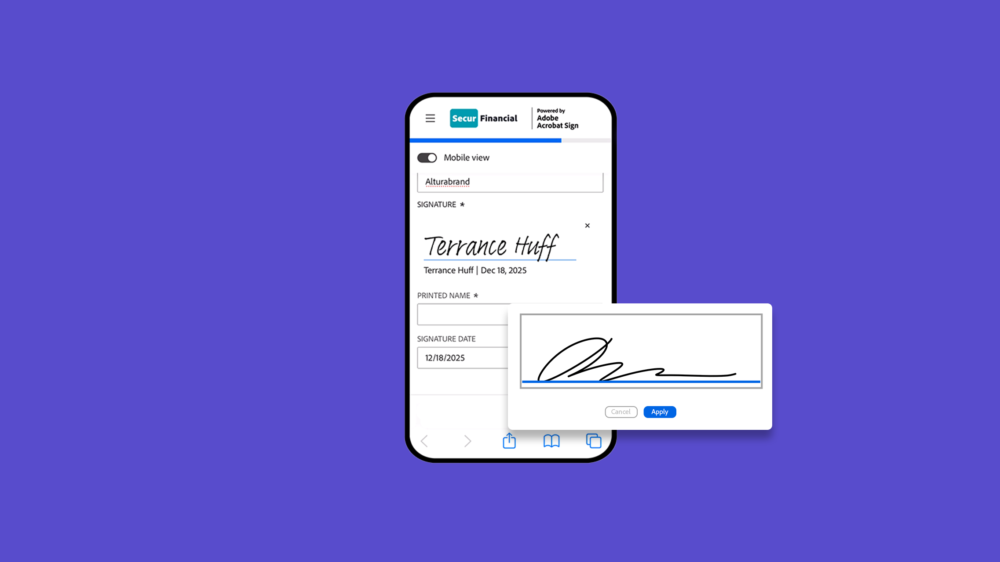
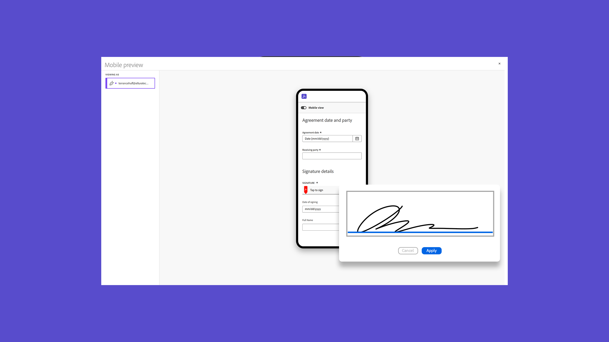
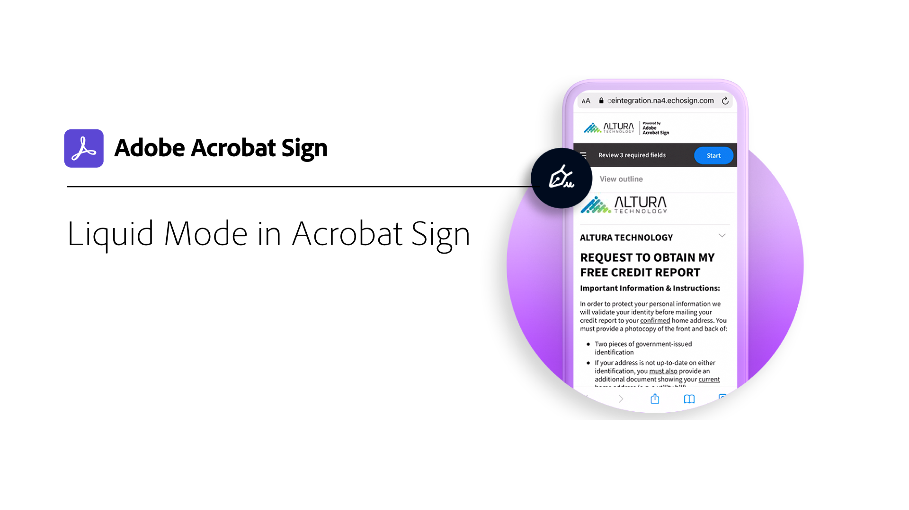
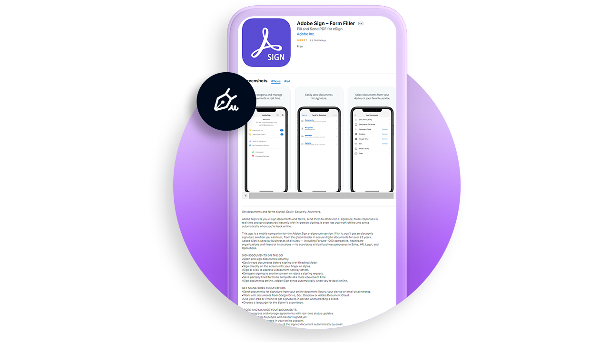
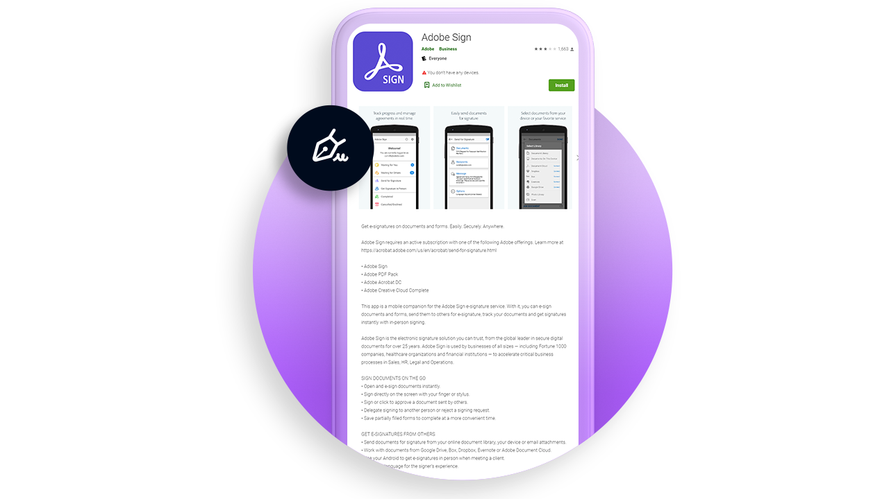

# Introducción a dispositivos móviles

Envía documentos para su firma, realiza un seguimiento del progreso de la firma electrónica y obtén actualizaciones en tiempo real en tu dispositivo móvil.

## Novedades

>[!BEGINTABS]

>[!TAB Vista compatible con dispositivos móviles]

Aprende a usar [vista compatible con dispositivos móviles](mobile-friendly.md) para rellenar formularios en tu dispositivo móvil.

>[!TAB Crear vista compatible con dispositivos móviles]

Aprende a generar un documento [compatible con dispositivos móviles](create-mobile-friendly.md) sin problemas y sin asistencia técnica por parte de los desarrolladores.

>[!ENDTABS]

<table style="table-layout:fixed">
<tr>
  <td>
    
    

    <a href="sign-mobile.md"><strong>Firma documentos sobre la marcha</strong></a>
    

    <em>Aprende a firmar documentos con la aplicación móvil de Acrobat Sign</em>
     
  </td>
  <td>
    
    

    <a href="mobile-friendly.md"><strong>Vista compatible con dispositivos móviles</strong></a>
    

    <em>Descubre cómo usar la vista compatible con dispositivos móviles para rellenar formularios en tu dispositivo móvil</em>
     
  </td>  
  <td>
    
    

    <a href="create-mobile-friendly.md"><strong>Crear vista compatible con dispositivos móviles</strong></a>
    

    <em>Aprende a generar un documento compatible con dispositivos móviles sin problemas y sin asistencia técnica por parte de los desarrolladores</em>
     
  </td>
   <td>
    
    

    <a href="liquidmode.md"><strong>Liquid Mode en Acrobat Sign</strong></a>
    

    <em>Descubre cómo Liquid Mode mejora la experiencia de firma móvil</em>
     
  </td>
</tr>
<tr>
  <td>
    
    

    <a href="https://apps.apple.com/us/app/adobe-acrobat-sign/id481082197_blank"><strong>Descargar la aplicación móvil de Acrobat Sign para iOS</strong></a>
    

    <em>Descargar la aplicación móvil de Acrobat Sign de App Store</em>
     
  </td>
  <td>
    
    

    <a href="https://play.google.com/store/apps/details?id=com.adobe.echosign&amp;hl=en&amp;pli=1_blank"><strong>Descargar la aplicación móvil de Acrobat Sign para Android</strong></a>
    

    <em>Descargar la aplicación móvil de Acrobat Sign de Google Play</em>
     
  </td>
  <td>
    
    

     
  </td>
  <td>
    
    

     
  </td>
</tr>
</table>
