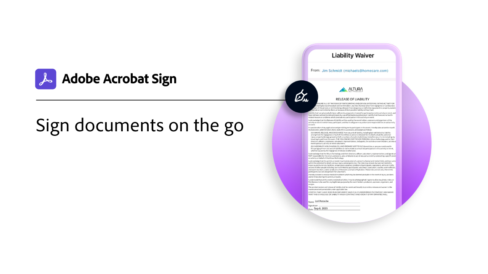

# Introducción a dispositivos móviles

Envía documentos para su firma, realiza un seguimiento del progreso de la firma electrónica y obtén actualizaciones en tiempo real en tu dispositivo móvil.

<table style="table-layout:fixed">
<tr>
  <td>
    
    

    <a href="sign-mobile.md"><strong>Firma documentos sobre la marcha</strong></a>
    

    <em>Aprenda a firmar documentos con la aplicación móvil de Acrobat Sign</em>
     
  </td>
  <td>
    
    

    <a href="liquidmode.md"><strong>Liquid Mode en Acrobat Sign</strong></a>
    

    <em>Descubre cómo Liquid Mode mejora la experiencia de firma móvil</em>
     
  </td>
  <td>
    
    

    <a href="https://apps.apple.com/es/app/adobe-sign/id481082197" target="_blank"><strong>Descargar la aplicación móvil de Acrobat Sign para iOS</strong></a>
     
  </td>
  <td>
    
    

    <a href="https://play.google.com/store/apps/details?id=com.adobe.echosign&amp;hl=es" target="_blank"><strong>Descargar la aplicación móvil de Acrobat Sign para Android</strong></a>
     
  </td>
</tr>
</table>
