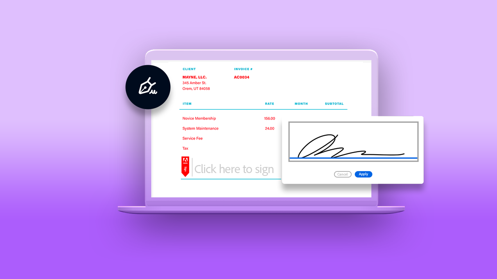
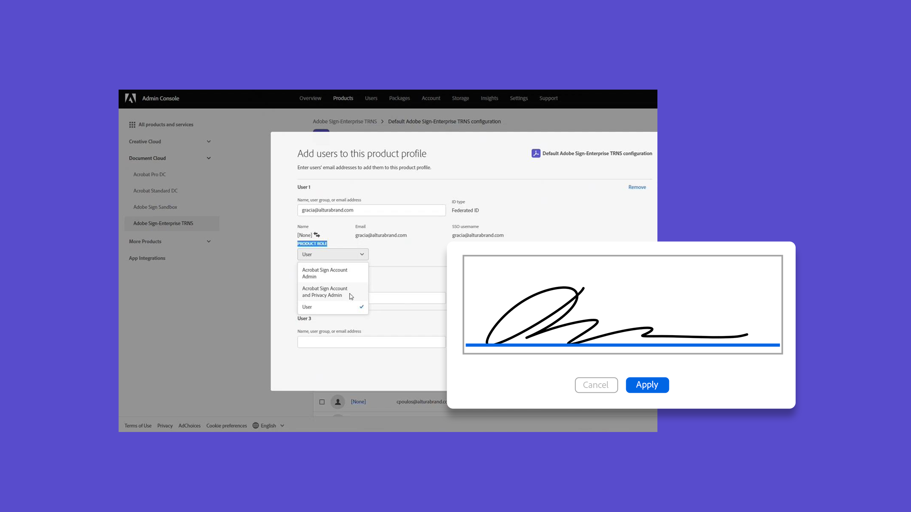

# Tutoriales de Acrobat Sign

Acrobat Sign, una solución de Adobe Document Cloud, se escala para satisfacer las necesidades de tu organización con integraciones, API, autenticación avanzada, funciones de administración adicionales y mucho más. Aquí puede encontrar una amplia gama de experiencias de aprendizaje diseñadas para poner al día rápidamente a los principiantes y administradores en Acrobat Sign.

## Rutas de aprendizaje

<table style="table-layout:fixed">
<tr>
  <td>
    
    

      <a href="sign-beginner-tutorials/beginner-users-overview.md"><strong>Introducción</strong></a>
      

      <em>Infórmate sobre cómo enviar, firmar y realizar el seguimiento de documentos</em>
       
  </td>
  <td>
    
    

      <a href="sign-advanced-users/advanced-users-overview.md"><strong>Tareas avanzadas</strong></a>
      

      <em>Ve más allá de lo básico con tareas específicas y automatización</em>
       
  </td>  
  <td>
    
    

      <a href="admin/intro-admin-overview.md"><strong>Administrar</strong></a>
      

      <em>Consejos de configuración básicos a avanzados para tu organización</em>
       
  </td>
  <td>
    
     

      <a href="digitalid/digitalid-overview.md"><strong>Id. digital</strong></a>
      

      <em>Aprende a usar ID digitales de todo el mundo en Acrobat Sign</em>
       
  </td>
</tr>
<tr>
  <td>
    
    

      <a href="integrations/integrations-overview.md"><strong>Integraciones</strong></a>
      

      <em>Agrega Acrobat Sign directamente dentro de otras aplicaciones que tu organización ya usa</em>
       
  </td>
  <td>
    
    

      <a href="sign-usecase/expand-inspire-overview.md"><strong>Sectores y departamentos</strong></a>
      

      <em>Explora casos prácticos reales del sector y de departamentos</em>
       
  </td>
  <td>
    
    

      <a href="develop/develop-overview.md"><strong>Revelar</strong></a>
      

      <em>Obtener recursos de desarrollo en Acrobat Sign I/O</em>
       
  </td>
   <td>
    
    

      <a href="deploy-overview.md"><strong>Implementar</strong></a>
      

      <em>Información y prácticas recomendadas para implementar Acrobat Sign en tu organización</em>
       
  </td>
</tr>
<tr>
  <td>
    
    

      <a href="mobile/mobile-overview.md"><strong>Para móviles</strong></a>
      

      <em>Envía, firma y obtén actualizaciones en tiempo real en tu dispositivo móvil</em>
       
  </td>  
</tr>
</table>
