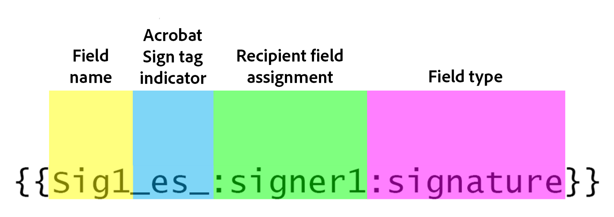
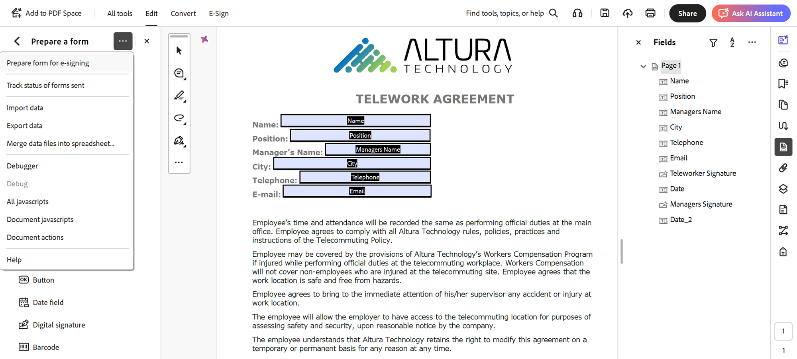
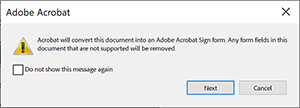
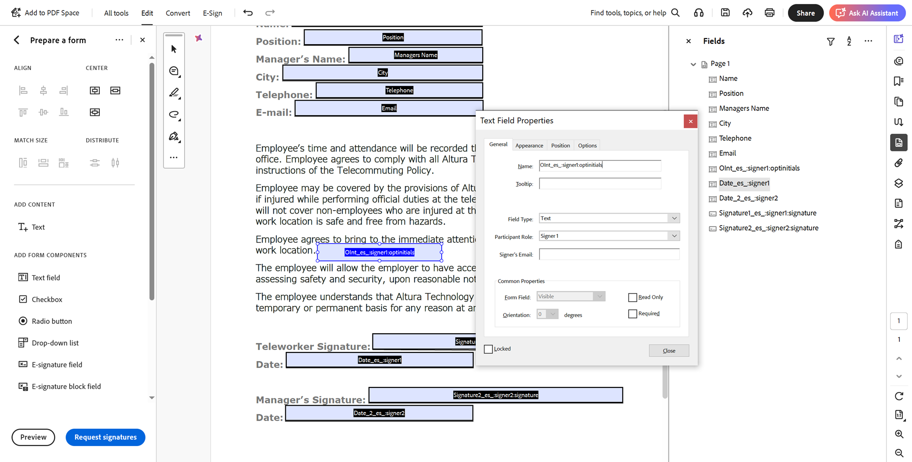
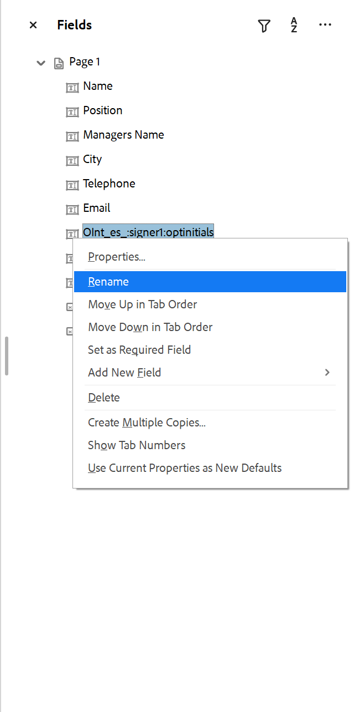

# Etiquetado de texto de Acrobat Sign

Aprenda a crear campos de formulario de Acrobat Sign con el etiquetado de texto. Las etiquetas de texto se pueden añadir directamente a herramientas de creación como Microsoft Word, Adobe InDesign o, si tienes un PDF, en Acrobat. Pueden reducir significativamente el esfuerzo que supone la preparación de documentos utilizados en Acrobat Sign. Después de cargar un documento etiquetado en Acrobat Sign, se puede configurar como una plantilla, lo que elimina la necesidad de que cualquier persona añada campos a sus documentos.

## Introducción

Las etiquetas de texto son fragmentos de texto con formato único colocados en cualquier parte de un documento que se reconocen automáticamente como campos cuando se cargan en Acrobat Sign.

Las etiquetas de texto se pueden añadir directamente a herramientas de creación como Microsoft Word, Adobe InDesign o, si tiene un PDF, Acrobat. Las etiquetas de texto reducen significativamente el esfuerzo que supone preparar documentos utilizados en Acrobat Sign.

### Agregar etiquetas en Microsoft Word

Para añadir etiquetas de texto a un documento de Microsoft Word, echa un vistazo a este [tutorial de vídeo](text-tagging-word.md).

### Añadir etiquetas en Acrobat

Adobe Acrobat cuenta con un sólido entorno de creación de formularios de arrastrar y soltar. La aplicación de etiquetas de texto en Acrobat le permite aprovechar las funciones adicionales disponibles en Acrobat Sign.

1. Abra el formulario en Acrobat.

1. Seleccione **[!UICONTROL Preparar un formulario]** en el panel **[!UICONTROL Todas las herramientas]**.

1. Seleccione **[!UICONTROL Crear formulario]**.

1. Seleccione **[!UICONTROL Preparar formulario para firma electrónica]** en el menú desplegable del panel **[!UICONTROL Opciones]**.

   

1. Seleccione **[!UICONTROL Siguiente]** para confirmar.

   

1. Haga doble clic en un campo para que aparezca el cuadro de diálogo **[!UICONTROL Propiedades]**.

   Utilice la sintaxis detallada en [Acrobat Sign Text Tag Guide](https://helpx.adobe.com/es/sign/using/text-tag.html) para cambiar el nombre del campo de formulario.

1. Por ejemplo, puede escribir *OInt_es_:signer1:optinitials* en el nombre del campo para que un campo inicial sea opcional.

   

   Las etiquetas de texto se agregan al nombre del campo de formulario y, a diferencia de la sintaxis que se utilizaría en Microsoft Word (u otras herramientas de creación), no se incluyen las llaves.

   Las etiquetas de texto también se pueden añadir en el panel Campos con solo cambiar el nombre del campo de formulario.

   

1. Guarde el archivo y ciérrelo.

1. Cargue el archivo en Acrobat Sign y cree una plantilla reutilizable como se describe en la sección siguiente.

### Crear una plantilla reutilizable

Después de crear un documento etiquetado, configúrelo como una plantilla reutilizable, lo que elimina la necesidad de que cualquier persona añada campos a sus documentos.

Para crear una plantilla reutilizable, echa un vistazo a este [tutorial de vídeo](../sign-advanced-users/create-a-template.md).
