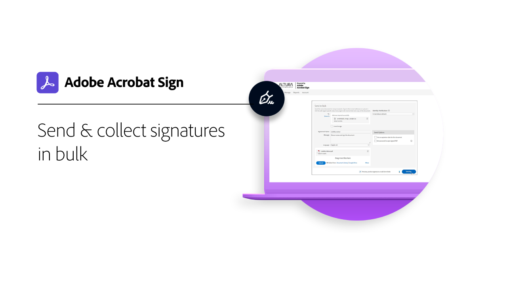

# Introducción a tareas avanzadas

Aprende a enviar un documento para que se firme a cientos de destinatarios a la vez, a configurar un documento listo para firmar para tu sitio web, a administrar transacciones de firma y a crear y administrar plantillas de documentos. Estos tutoriales están destinados a cualquier persona que ya esté familiarizada con los conceptos básicos del envío y la solicitud de firmas y que desee obtener más información sobre cómo Adobe Sign puede trabajar para ellos.

## Enviando

<table style="table-layout:fixed">
<tr>
  <td>
    
    

    <a href="setting-up-routing.md"><strong>Configuración del orden de enrutamiento</strong></a>
    

    <em>Configurar el orden de enrutamiento para varios firmantes</em>
     
  </td>
  <td>
      
    

    <a href="delegate-signature.md"><strong>Delegar en otra persona</strong></a>
    

    <em>Utilice la función de delegador para enviar un documento a un intermediario que pueda enviar el documento para su firma</em>
     
  </td>
  <td>
    
    

    <a href="add-an-approver.md"><strong>Añadir un aprobador</strong></a>
    

    <em>Añadir una función de aprobador al proceso de aprobación del contrato</em>
     
  </td>
</tr>
<tr>
  <td>
    
    

    <a href="megasign.md"><strong>Recopilación de firmas en bloque</strong></a>
    

    <em>Recopila cientos de firmas a la vez para cualquier documento en solo unos pasos</em>
     
  </td>
  <td>
    
    

    <a href="webform.md"><strong>Configurar un formulario web</strong></a>
    

    <em>Crea un documento que se pueda firmar electrónicamente directamente en tu sitio web</em>
     
  </td> 
  <td>
    
    

    <a href="adobe-sign-text-tagging.md"><strong>Etiquetado de texto de Adobe Sign</strong></a>
    

    <em>Creación de campos de formulario de Adobe Sign mediante el etiquetado de texto con Adobe Acrobat</em>
     
  </td> 
</table>

## Gestión

<table style="table-layout:fixed">
<tr>
  <td>
    
    

    <a href="edit-a-template.md"><strong>Administración de plantillas de documento</strong></a>
    

    <em>Editar o eliminar una plantilla de la biblioteca</em>
     
  </td>  
  <td>
    
    

     
  </td>
  <td>
    
    

     
  </td>
</tr>
</table>
