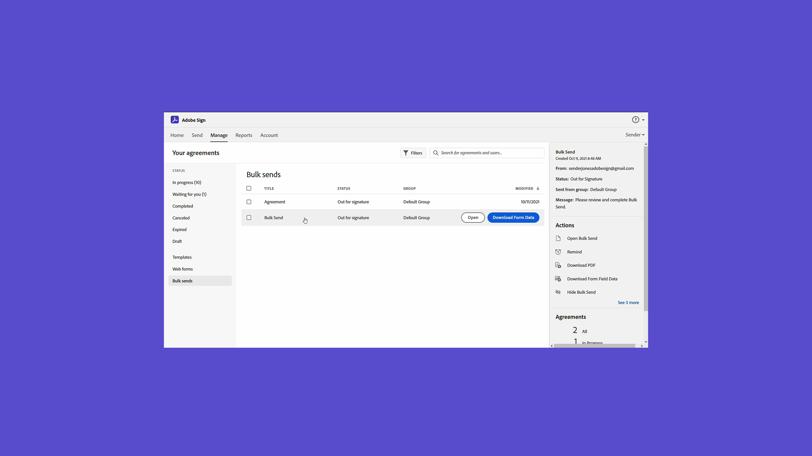

# Introducción a tareas avanzadas

Aprende a enviar un documento para que se firme a cientos de destinatarios a la vez, a configurar un documento listo para firmar para tu sitio web, a administrar transacciones de firma y a crear y administrar plantillas de documentos. Estos tutoriales están destinados a cualquier persona que ya esté familiarizada con los conceptos básicos del envío y la solicitud de firmas y que desee obtener más información sobre cómo Acrobat Sign puede trabajar para ellos.

## Novedades

* [Métodos de autenticación en Acrobat Sign](authentication-methods.md)
Obtenga más información sobre el rango de métodos disponibles en Acrobat Sign para autenticar la identidad de alguien que firma un documento
* [Administrar datos de formulario](manage-form-data.md)
Aprenda a consolidar datos de formulario de sus documentos

## Envíar

<table style="table-layout:fixed">
<tr>
  <td>
    
    

    <a href="setting-up-routing.md"><strong>Configuración del pedido de firma</strong></a>
    

    <em>Configurar el orden de firma para varios firmantes</em>
     
  </td>
  <td>
      
    

    <a href="delegate-signature.md"><strong>Uso de la función del delegador</strong></a>
    

    <em>Utilice la función de delegador para enviar un documento a un intermediario que pueda enviar el documento para su firma</em>
     
  </td>
  <td>
    
    

    <a href="add-an-approver.md"><strong>Uso de la función de aprobador</strong></a>
    

    <em>Añadir una función de aprobador al proceso de aprobación del contrato</em>
     
  </td>
  <td>
    
    

    <a href="authentication-methods.md"><strong>Métodos de autenticación en Acrobat Sign</strong></a>
    

    <em>Obtenga más información sobre la gama de métodos de autenticación de la identidad disponibles en Acrobat Sign</em>
     
  </td>
</tr>
<tr>
  <td>
      
      

      <a href="manage-form-data.md"><strong>Administrar datos de formulario</strong></a>
      

      <em>Aprenda a consolidar datos de formulario de sus documentos</em>
       
    </td>
  <td>
    
    

    <a href="set-up-online-payments.md"><strong>Configuración de pagos en línea</strong></a>
    

    <em>Conozca cómo configurar y aceptar pagos en línea en sus documentos</em>
     
  </td>
  <td>
      
      

      <a href="megasign.md"><strong>Enviar y recopilar firmas en bloque</strong></a>
      

      <em>Recopila cientos de firmas a la vez para cualquier documento en solo unos pasos</em>
       
  </td>
  <td>
    
    

    <a href="webform-multiple-signers.md"><strong>Crear un formulario web con varios firmantes desconocidos</strong></a>
    

    <em>Aprenda a crear un formulario web complejo con varios participantes desconocidos</em>
     
  </td>
</tr>
<tr>
  <td>
      
      

      <a href="adobe-sign-text-tagging.md"><strong>Etiquetado de texto de Acrobat Sign</strong></a>
      

      <em>Creación de campos de formulario de Acrobat Sign mediante el etiquetado de texto con Adobe Acrobat</em>
       
    </td>
  <td>
      
      

      <a href="adobe-sign-text-tagging.md"><strong>Etiquetado de texto de Acrobat Sign</strong></a>
      

      <em>Creación de campos de formulario de Acrobat Sign mediante el etiquetado de texto con Adobe Acrobat</em>
       
    </td>
  <td>
    
    

    <a href="text-tagging-word.md"><strong>Uso del etiquetado de texto en [!DNL Microsoft Word]</strong></a>
    

    <em>Aprenda a crear una plantilla de documento reutilizable añadiendo etiquetas de texto de Acrobat Sign en [!DNL Microsoft Word]</em>
     
  </td>
  <td>
    
    

     
  </td>
</tr>
</table>

## Gestión

<table style="table-layout:fixed">
<tr>
<td>
    
    

    <a href="creating-a-report.md"><strong>Creación de un informe</strong></a>
    

    <em>Aprende a crear tus propios informes para ganar visibilidad en el proceso de firma de documentos</em>
     
  </td>
  <td>
    
    

    <a href="edit-a-template.md"><strong>Administrar plantillas de documento</strong></a>
    

    <em>Editar o eliminar una plantilla de la biblioteca</em>
     
  </td>
  <td>
    
    

    <a href="modify-webform.md"><strong>Modificar un formulario web existente</strong></a>
    

    <em>Aprenda a deshabilitar, editar y volver a habilitar un formulario web existente</em>
     
  </td>  
  <td>
    
    

    <a href="manage-webform-data.md"><strong>Administración de datos de formulario web</strong></a>
    

    <em>Aprenda a rastrear, administrar y exportar datos desde un formulario web</em>
     
  </td>  
</tr>
</table>