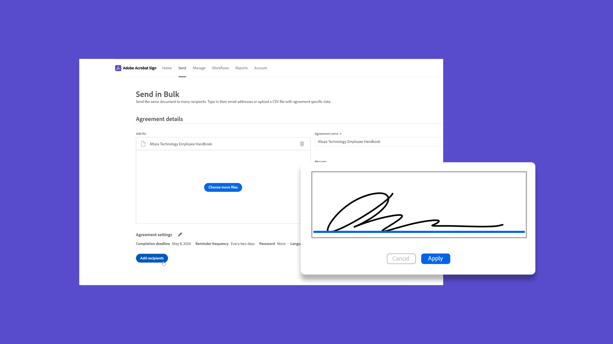
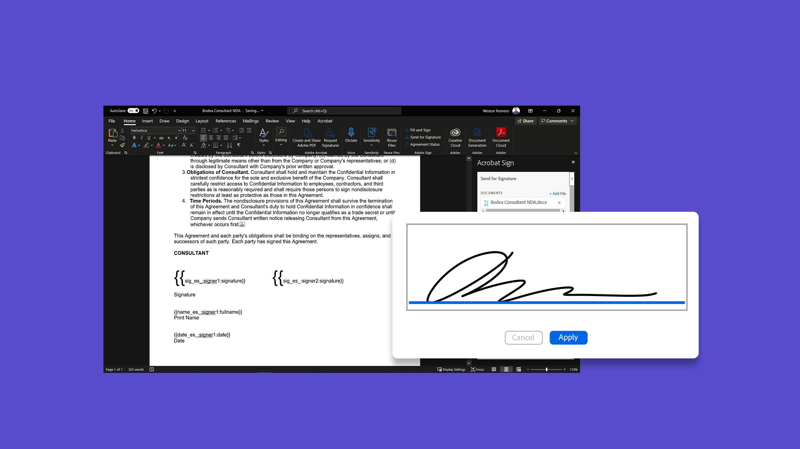
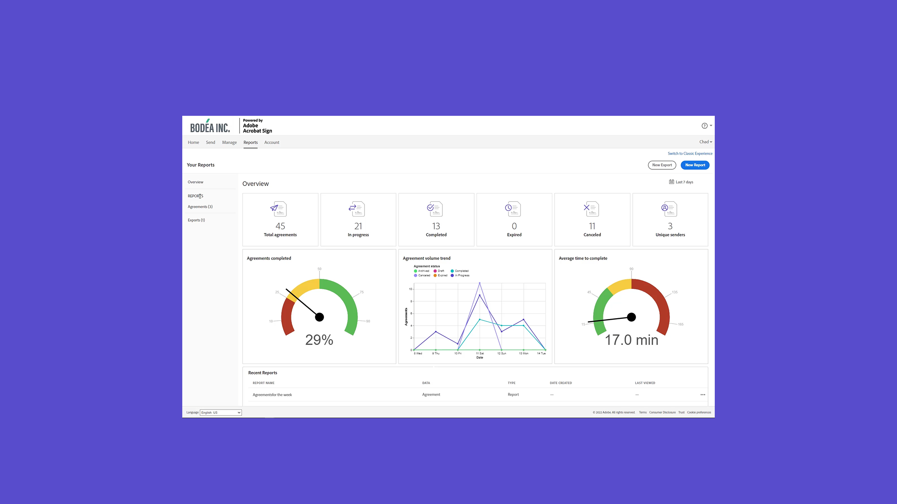

# Introducción a las tareas avanzadas

Aprende a enviar un documento para que se firme a cientos de destinatarios a la vez, a configurar un documento listo para firmar para tu sitio web, a administrar transacciones de firma y a crear y administrar plantillas de documentos. Estos tutoriales están destinados a cualquier persona que ya esté familiarizada con los conceptos básicos del envío y la solicitud de firmas y que desee obtener más información sobre cómo Acrobat Sign puede trabajar para ellos.

## Novedades

>[!BEGINTABS]

>[!TAB Crear un flujo de trabajo personalizado]

>[!TAB Enviar en bloque]

Aprende a [recopilar miles](megasign.md) de firmas a la vez para cualquier documento en solo unos pasos.

>[!TAB Métodos de autenticación en Acrobat Sign]

Obtenga información sobre el rango de métodos disponibles en Acrobat Sign para [autenticar](authentication-methods.md) la identidad de alguien que firma un documento.

>[!ENDTABS]

## Enviar

<table style="table-layout:fixed">
<tr>
  <td>
    
    

    <a href="setting-up-routing.md"><strong>Configurando orden de firma</strong></a>
    

    <em>Configurar el orden de firma para varios firmantes</em>
     
  </td>
  <td>
      
    

    <a href="delegate-signature.md"><strong>Uso del rol de delegador</strong></a>
    

    <em>Use la función de delegador para enviar un documento a un intermediario que pueda enviar el documento para su firma</em>
     
  </td>
  <td>
    
    

    <a href="add-an-approver.md"><strong>Usar el rol de aprobador</strong></a>
    

    <em>Agregar una función de aprobador al proceso de aprobación del contrato</em>
     
  </td>
  <td>
      
      

      <a href="megasign.md"><strong>Enviar en bloque</strong></a>
      

      <em>Recopila cientos de firmas a la vez para cualquier documento en solo unos pasos</em>
       
  </td>
</tr>
<tr>
  <td>
      
      

      <a href="webform.md"><strong>Creando un formulario web</strong></a>
      

      <em>Aprende a crear un documento que se pueda firmar electrónicamente directamente en tu sitio web</em>
       
  </td>
  <td>
      
      

      <a href="../admin/building-a-custom-workflow.md"><strong>Crear un flujo de trabajo personalizado</strong></a>
      

      <em>Aprende a crear y usar flujos de trabajo personalizados para acelerar el proceso de crear y enviar un acuerdo</em>
       
  </td>
  <td>
      
      

      <a href="set-up-online-payments.md"><strong>Configurar pagos en línea</strong></a>
      

      <em>Descubre cómo configurar y aceptar pagos en línea en tus documentos</em>
       
  </td>
  <td>
      
      

      <a href="authentication-methods.md"><strong>Métodos de autenticación en Acrobat Sign</strong></a>
      

      <em>Obtener información sobre el intervalo de métodos de autenticación de la identidad disponibles en Acrobat Sign</em>
       
  </td>
</tr>
<tr>
  <td>
      
      

      <a href="adobe-sign-text-tagging.md"><strong>Etiquetado de texto de Acrobat Sign</strong></a>
      

      <em>Crear campos de formulario de Acrobat Sign mediante el etiquetado de texto con Adobe Acrobat</em>
       
    </td>
  <td>
    
    

    <a href="text-tagging-word.md"><strong>Uso del etiquetado de texto en [!DNL Microsoft Word]</strong></a>
    

    <em>Aprende a crear una plantilla de documento reutilizable agregando etiquetas de texto de Acrobat Sign en [!DNL Microsoft Word]</em>
     
  </td>
  <td>
    
    

     
  </td>
  <td>
    
    

     
  </td>
</tr>
</table>

## Administrar

<table style="table-layout:fixed">
<tr>
<td>
    
    

    <a href="creating-a-report.md"><strong>Uso de informes y transacciones</strong></a>
    

    <em>Obtener información sobre cómo generar informes y realizar un seguimiento del uso de transacciones</em>
     
  </td>
  <td>
    
    

    <a href="edit-a-template.md"><strong>Administrar plantillas de documentos</strong></a>
    

    <em>Editar o eliminar una plantilla de tu biblioteca</em>
     
  </td>
  <td>
    
    

    <a href="modify-webform.md"><strong>Modificar un formulario web existente</strong></a>
    

    <em>Obtenga información sobre cómo deshabilitar, editar y volver a habilitar un formulario web existente</em>
     
  </td>  
  <td>
    
    

    <a href="manage-webform-data.md"><strong>Administrar datos de formulario web</strong></a>
    

    <em>Aprende a administrar y exportar datos de un formulario web, así como a realizar su seguimiento</em>
     
  </td>  
</tr>
<tr>
  <td>
      
      

      <a href="manage-form-data.md"><strong>Administrar datos de formulario</strong></a>
      

      <em>Aprende a consolidar datos de formulario de tus documentos</em>
       
    </td>
    <td>
    
    

     
  </td>
  <td>
    
    

     
  </td>
  <td>
    
    

     
  </td>
</tr>
</table>