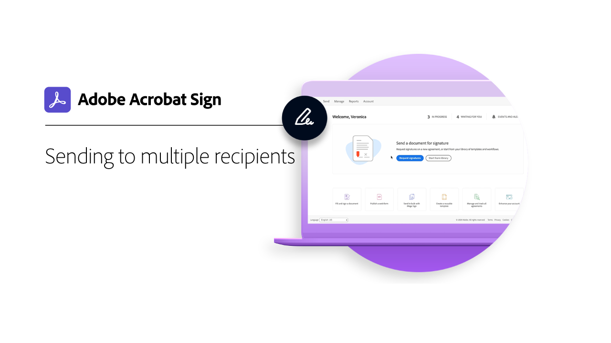
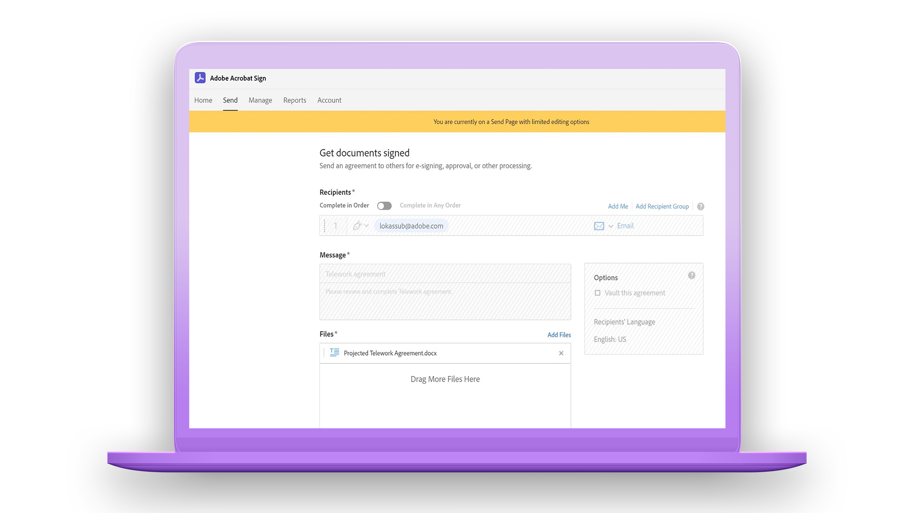
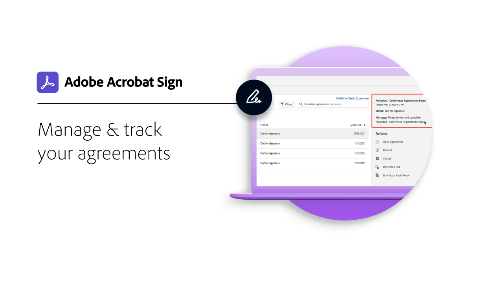

# Introducción a la introducción

Obtén información actualizada sobre cómo enviar y firmar documentos, y realizar su seguimiento, con estos breves tutoriales paso a paso. Date una vuelta rápida por Acrobat Sign y, después, empieza a enviar un documento a una o más personas. Este contenido está diseñado para facilitarle los flujos de trabajo de firma electrónica.

## Enviando

<table style="table-layout:fixed">
<tr>
 <td>
    
    

    <a href="quick-tour.md"><strong>Conceptos básicos del área de trabajo</strong></a>
    

    <em>Date una vuelta rápida por el espacio de trabajo de Acrobat Sign para empezar a trabajar</em>
     
  </td>
  <td>
    
    

    <a href="send-to-single-recipient.md"><strong>Enviar a un único destinatario</strong></a>
    

    <em>Entra y descubre lo fácil que es enviar un documento para que se firme</em>
     
  </td>
  <td>
    
    

    <a href="send-to-multiple-recipients.md"><strong>Enviar a varios destinatarios</strong></a>
    

    <em>Envía un documento para su firma electrónica a más de una persona exactamente en el orden que desees</em>
     
  </td>
</tr>
<tr>
  <td>
    
    

    <a href="new-sender.md"><strong>Introducción a Acrobat Sign para nuevos remitentes</strong></a>
    

    <em>Este completo tutorial es un buen punto de partida para los nuevos remitentes en Acrobat Sign</em>
     
  </td>
 <td>
    
    

    <a href="modify-in-flight.md"><strong>Modificación de un documento después de enviarlo</strong></a>
    

    <em>Modificar un documento que ya está en curso</em>
     
  </td>
 <td>
    
    

    <a href="replace-signer.md"><strong>Sustitución de un firmante</strong></a>
    

    <em>Aprenda a cambiar el firmante de un documento que ya está en curso</em>
      
  </td>
</tr>
</table>

## Signing

<table style="table-layout:fixed">
<tr>
  <td>
    
    

    <a href="electronically-sign-a-document.md"><strong>Firmar electrónicamente un documento</strong></a>
    

    <em>Descubra lo fácil que es firmar un documento que se le envía con Acrobat Sign</em>
     
  </td>
  <td>
    
    

    <a href="fill-and-sign.md"><strong>Rellenar y firmar un documento</strong></a>
    

    <em>Rellena formularios y añade tu firma electrónica a los documentos</em>
     
  </td>
  <td>
    
    

    <a href="sign-in-person.md"><strong>Obtención de una firma en persona</strong></a>
    

    <em>Obtener la firma de otra persona mediante la aplicación móvil de Acrobat Sign</em>
     
  </td>
</tr>
<tr>
  <td>
    
    

    <a href="delegate-signing.md"><strong>Delegar la firma a otra persona</strong></a>
    

    <em>Descubra cómo delegar la firma de un documento a otra persona</em>
     
  </td>
  <td>
    
    

    <a href="sign-with-a-digital-signature.md"><strong>¿Qué es una firma digital?</strong></a>
    

    <em>Más información sobre las firmas digitales basadas en certificados</em>
     
  </td>
  <td>
    
    

    <a href="sign-with-a-stamp.md"><strong>Firmar con un sello</strong></a>
    

    <em>Utilizar sellos para marcar un documento aprobado o completado</em>
      
  </td> 
</tr>  
</table>

## Gestión

<table style="table-layout:fixed">
<tr>
  <td>
    
    

    <a href="manage-and-track.md"><strong>Administrar y realizar un seguimiento de los acuerdos</strong></a>
    

    <em>Aprenda a administrar y realizar un seguimiento de los acuerdos enviados para firmar</em>
     
  </td>
  <td>
    
    

    <a href="../sign-advanced-users/create-a-template.md"><strong>Creación de una plantilla de documento</strong></a>
    

    <em>Crea una plantilla de documento reutilizable para proporcionar velocidad y coherencia a tu organización</em>
     
  </td>
  <td>
    
    

     
  </td>
</tr>
</table>
