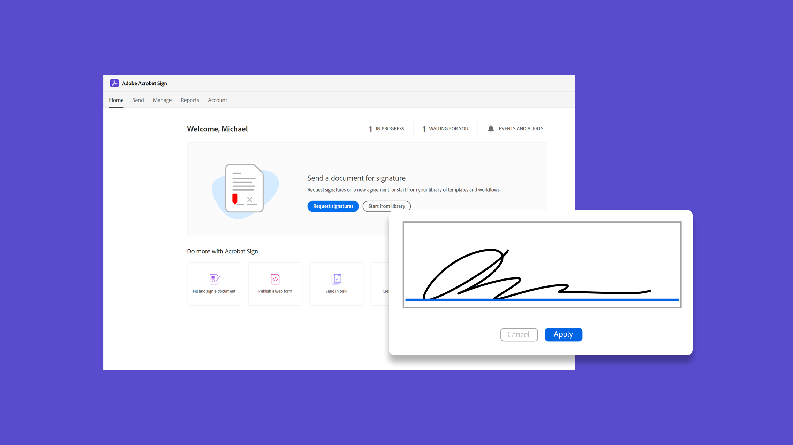
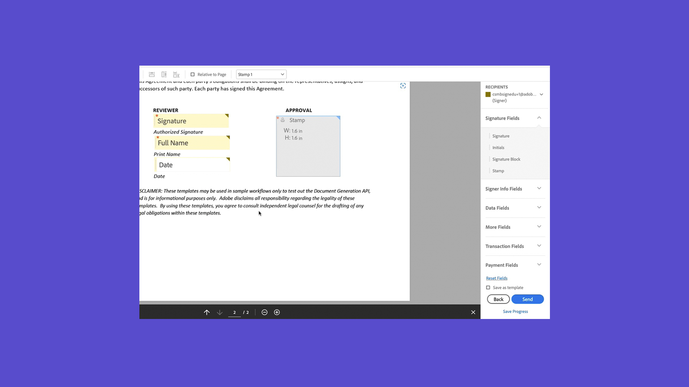

# Introducción a la introducción

Obtén información actualizada sobre cómo enviar y firmar documentos, así como realizar su seguimiento, con estos breves tutoriales paso a paso. Date una vuelta rápida por Acrobat Sign y, después, empieza a enviar un documento a una o más personas. Este contenido está diseñado para facilitarle los flujos de trabajo de firma electrónica.

## Novedades

>[!BEGINTABS]

>[!TAB Introducción a Acrobat Sign]

¿Es nuevo en el uso de Acrobat Sign? Este [tutorial](new-sender.md) es un buen punto de partida.

>[!TAB Establecer fechas límite y recordatorios]

Aprende a enviar correos electrónicos regulares [recordatorios y fechas límite](set-deadlines-reminders.md) para ayudarte a conseguir que tus documentos se firmen rápidamente.

>[!ENDTABS]

## Enviar

<table style="table-layout:fixed">
<tr>
 <td>
    
    

    <a href="quick-tour.md"><strong>Conceptos básicos del área de trabajo</strong></a>
    

    Date una vuelta rápida por el espacio de trabajo de Acrobat Sign para empezar a trabajar
     
  </td>
  <td>
    
    

    <a href="new-sender.md"><strong>Introducción a Acrobat Sign</strong></a>
    

    Este tutorial es un buen punto de partida para nuevos usuarios en Acrobat Sign
     
  </td>
  <td>
    
    

    <a href="send-to-single-recipient.md"><strong>Enviando a un solo destinatario</strong></a>
    

    Entra y descubre lo fácil que es enviar un documento para que se firme
     
  </td>
  <td>
    
    

    <a href="send-to-multiple-recipients.md"><strong>Enviando a varios destinatarios</strong></a>
    

    Envía un documento para su firma electrónica a más de una persona exactamente en el orden que desees
     
  </td>
</tr>
<tr>
  <td>
    
    

    <a href="sending-options.md"><strong>Configurar opciones de envío</strong></a>
    

    Obtenga información sobre cómo configurar varias opciones al enviar un documento para su firma
     
  </td>
  <td>
    
    

    <a href="adding-fields.md"><strong>Agregando campos a tus documentos</strong></a>
    

    Aprenda a agregar diferentes tipos de campos a los documentos
     
  </td>
  <td>
    
    

    <a href="modify-in-flight.md"><strong>Modificando un documento después de enviarlo</strong></a>
    

    Modificar un documento que ya está en curso
     
  </td>
  <td>
    
    

    <a href="replace-signer.md"><strong>Reemplazar un firmante</strong></a>
    

    Obtenga información sobre cómo cambiar el firmante de un documento que ya está en curso
      
  </td>
</tr>
<tr>
  <td>
      
      

      <a href="set-deadlines-reminders.md"><strong>Establecer fechas límite y recordatorios</strong></a>
      

      Aprenda a enviar recordatorios y plazos de entrega regulares por correo electrónico para ayudarle a firmar sus documentos rápidamente
       
    </td> 
  <td>
      
      

       
    </td>
    <td>
      
      

       
    </td>
    <td>
      
      

       
    </td>
</tr>
</table>

## Firmar

<table style="table-layout:fixed">
<tr>
  <td>
    
    

    <a href="electronically-sign-a-document.md"><strong>Firmar electrónicamente un documento</strong></a>
    

    Descubra lo fácil que es firmar un documento que se le envía con Acrobat Sign
     
  </td>
  <td>
    
    

    <a href="fill-and-sign.md"><strong>Rellenar y firmar un documento</strong></a>
    

    Rellena formularios y añade tu firma electrónica a los documentos
     
  </td>
  <td>
    
    

    <a href="sign-in-person.md"><strong>Obteniendo una firma en persona</strong></a>
    

    Obtener la firma de otra persona mediante la aplicación móvil de Acrobat Sign
     
  </td>
  <td>
    
    

    <a href="delegate-signing.md"><strong>Delegar firma a otra persona</strong></a>
    

    Descubra cómo delegar la firma de un documento a otra persona
     
  </td>
</tr>
<tr>
  <td>
    
    

    <a href="sign-with-a-digital-signature.md"><strong>Qué es una firma digital</strong></a>
    

    Más información sobre las firmas digitales basadas en certificados
     
  </td>
  <td>
    
    

    <a href="sign-with-a-stamp.md"><strong>Firmar con un sello</strong></a>
    

    Utilizar sellos para marcar un documento aprobado o completado
      
  </td> 
 <td>
    
    

     
  </td>
  <td>
    
    

     
  </td>
</tr>  
</table>

## Administrar

<table style="table-layout:fixed">
<tr>
  <td>
    
    

    <a href="manage-and-track.md"><strong>Administrar y realizar un seguimiento de los acuerdos</strong></a>
    

    Aprenda a administrar y realizar un seguimiento de los acuerdos enviados para firmar
     
  </td>
  <td>
    
    

    <a href="../sign-advanced-users/create-a-template.md"><strong>Creando una plantilla de documento</strong></a>
    

    Crea una plantilla de documento reutilizable para proporcionar velocidad y coherencia a tu organización
     
  </td>
  <td>
    
    

     
  </td>
  <td>
    
    

     
  </td>
</tr>
</table>
