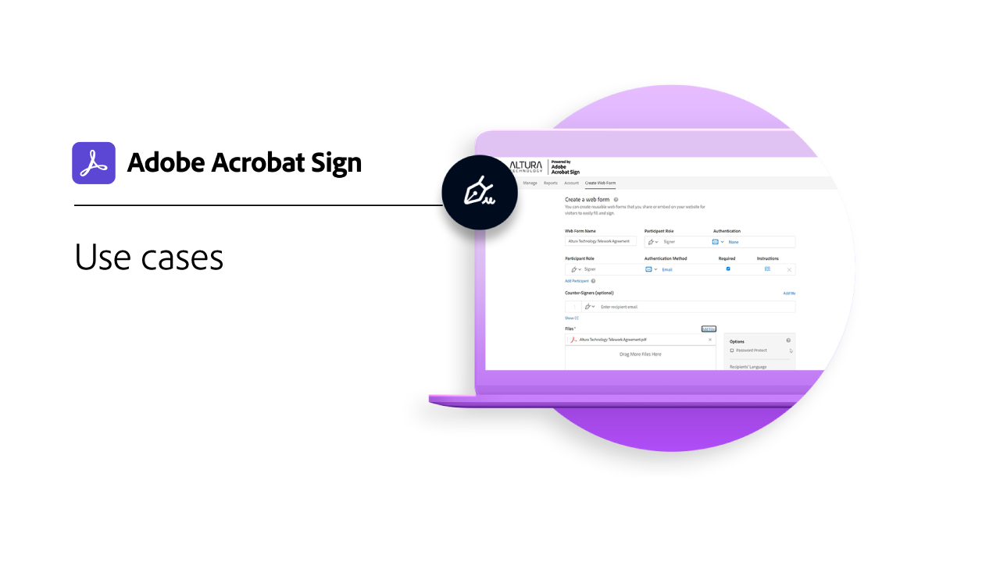

# Descripción general de sectores y departamentos

Descubre cómo puedes transformar las experiencias de firma electrónica de tu organización explorando estos casos prácticos, recetas y seminarios web reales del sector y los departamentos.

<table style="table-layout:fixed">
<tr>
  <td>
    
    

    <a href="innovation-series.md"><strong>Generador de aptitudes</strong></a>
    

    <em>Únete a nosotros en un Skill Builder de 30 minutos para aprender a poner a trabajar tus firmas electrónicas, sin añadir más trabajo a tu día</em>
     
  </td>
  <td>
    
    

    <a href="recipes.md"><strong>Casos prácticos</strong></a>
    

    <em>Descubre cómo varias organizaciones están usando Acrobat Sign con estos casos prácticos del mundo real</em>
     
  </td>
 </td>
  <td>
    
    

     
  </td>
  <td>
    
    

     
  </td>
</tr>
</table>
