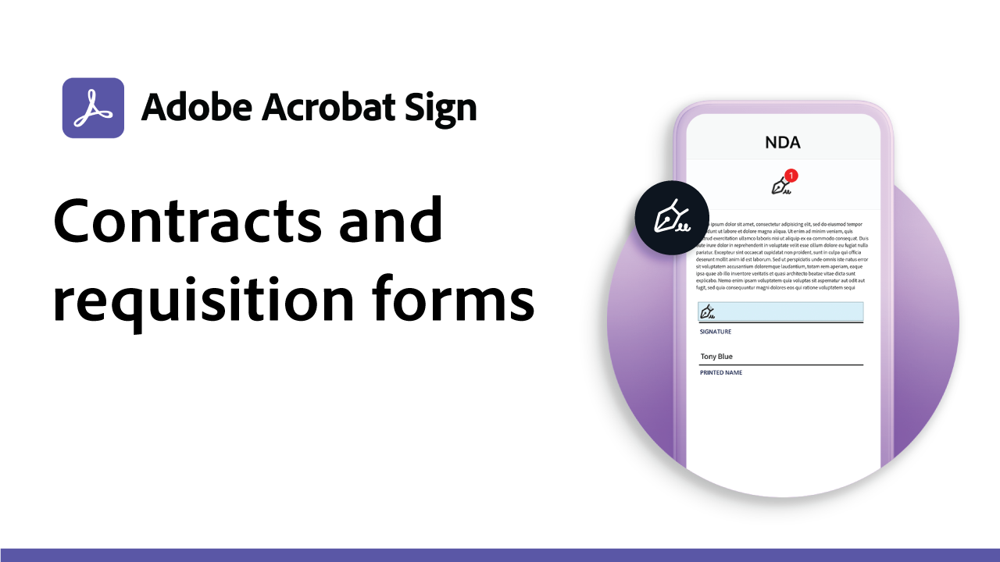
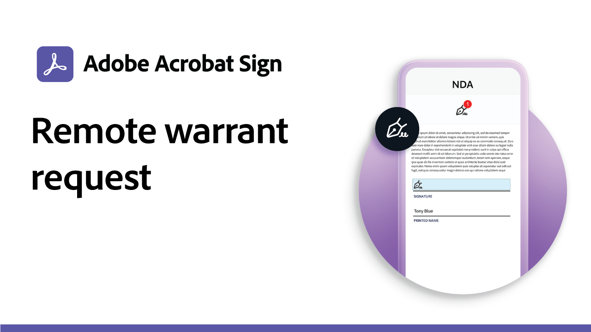

# Recetas de casos prácticos

Acelera los flujos de trabajo digitales de tu organización con estos ejemplos de firmas electrónicas comerciales y de la administración pública. Haga clic aquí para ver un PDF con recursos y detalles sobre cómo configurar estos casos prácticos específicos de firma electrónica.

## Casos prácticos del gobierno

<table style="table-layout:fixed">
<tr>
  <td>
    
    

    <a href="usecasegovgrants.md"><strong>Subvenciones y préstamos empresariales</strong></a>
    

    <em>Proporcionar asistencia rápida a las empresas al proporcionar acceso de autoservicio a los formularios de solicitud de subvención, préstamo y aplazamiento de impuestos</em>
     
  </td> 
  <td>
    
    

    <a href="usecasegovtelework.md"><strong>Acuerdo de teletrabajo</strong></a>
    

    <em>Recopila firmas de forma eficaz de todos tus empleados en acuerdos de teletrabajo, actualizaciones de políticas y mucho más</em>
     
  </td>
  <td>
    
    

    <a href="usecasegovcontracts.md"><strong>Contratos y formularios de solicitud</strong></a>
    

    <em>Reemplaza rápidamente el procesamiento de papel con flujos de trabajo digitales que cumplen con la normativa, y completa con informes de auditoría</em>
     
  </td>
</tr>
<tr>
  <td>
    
    

    <a href="usecasegovreemployment.md"><strong>Asistencia para reempleo</strong></a>
    

    <em>Ayuda a los ciudadanos a obtener la ayuda que necesitan sin alinearse con los formularios de solicitud completamente digitales que pueden activarse en cuestión de días</em>
     
  </td>
  <td>
    
    

    <a href="usecasegovpaycheck.md"><strong>Protección de cheque</strong></a>
    

    <em>Descubre cómo puedes usar Acrobat Sign para convertir el formulario del Programa de protección de pagos en un formulario interactivo online</em>
     
  </td>
  <td>
    
    

    <a href="usecasegovremote.md"><strong>Solicitud de orden remota</strong></a>
    

    <em>Utiliza las firmas electrónicas y las conferencias web de forma conjunta para reducir el tiempo que se tarda en solicitar y garantizar las garantías de los jueces</em>
     
  </td>
</tr>
</table>

## Casos prácticos comerciales

<table style="table-layout:fixed">
<tr>
  <td>
    
    

    <a href="usecasecomcontracts.md"><strong>Contratos y formularios de solicitud</strong></a>
    

    <em>Reemplaza rápidamente el procesamiento de papel con flujos de trabajo digitales que cumplen con la normativa, y completa con informes de auditoría</em>
     
  </td> 
  <td>
    
    

    <a href="usecasecompolicy.md"><strong>Acuerdos de política</strong></a>
    

    <em>Recopila firmas de todos tus empleados de forma eficaz en acuerdos y actualizaciones de políticas</em>
     
  </td>
  <td>
    
    

    <a href="usecasecomtelework.md"><strong>Acuerdo de teletrabajo</strong></a>
    

    <em>Recopila firmas de todos tus empleados de forma eficaz en los acuerdos de teletrabajo</em>
     
  </td>
</tr>
</table>
