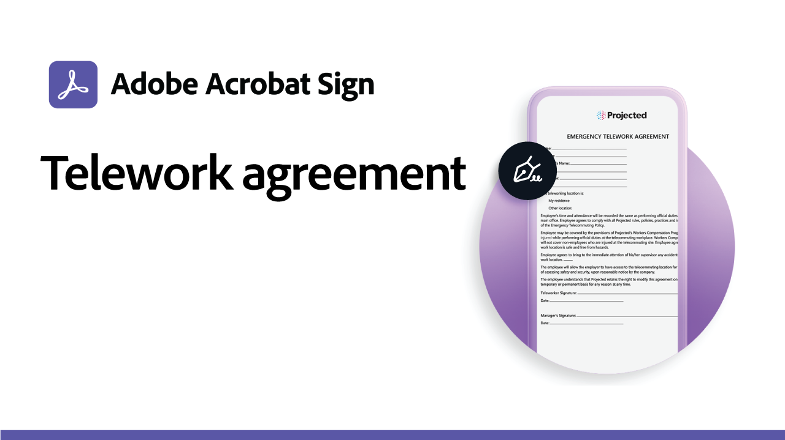
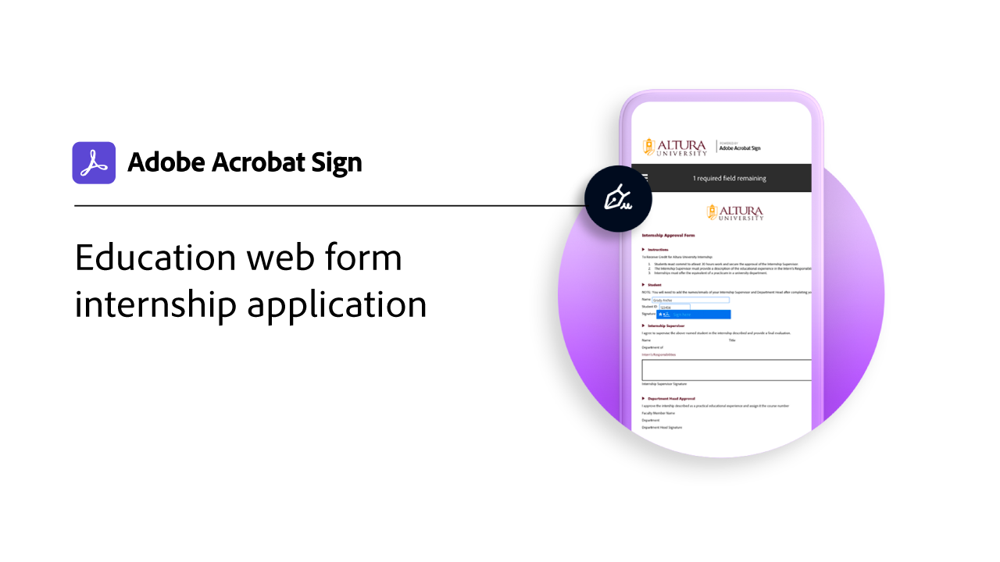

# Casos prácticos

Descubre cómo varias organizaciones están utilizando Acrobat Sign para transformar los flujos de trabajo digitales de su organización con estos casos prácticos del mundo real.

## Novedades

* [Flujo de trabajo personalizado para el proceso IEP del sector educativo](usecase-edu-iep.md)
Obtenga información sobre cómo se utiliza el Designer de flujos de trabajo personalizados para digitalizar un proceso del Programa de educación individualizada (IEP)
* [Aplicación de prácticas de formularios web educativos](usecase-edu-intern.md)
Descubre cómo se utilizan los formularios web para mejorar el acceso de los estudiantes a los formularios necesarios
* [Crear una aplicación de prácticas de formularios web educativos](usecase-edu-intern-create.md)
Aprende a crear un formulario web de prácticas
* [Aplicación de préstamo gubernamental con varios firmantes desconocidos](webform-multiple-signers.md)
Obtenga información sobre cómo se utiliza un formulario web para un flujo de trabajo complejo de solicitud de préstamo gubernamental que implica a varios participantes desconocidos

## Casos prácticos del gobierno

<table style="table-layout:fixed">
<tr>
  <td>
    
    

    <a href="webform-multiple-signers.md"><strong>Aplicación de préstamo gubernamental con varios firmantes desconocidos</strong></a>
    

    <em>Descubre cómo se usa un formulario web para un flujo de trabajo complejo de solicitud de préstamos del gobierno en el que participan varios participantes desconocidos</em>
     
  </td> 
  <td>
    
    

    <a href="usecasegovgrants.md"><strong>Préstamos y subsidios para empresas</strong></a>
    

    <em>Proporciona asistencia rápida a las empresas al proporcionar acceso de autoservicio a los formularios de solicitud de concesión, préstamo y aplazamiento de impuestos</em>
     
  </td> 
  <td>
    
    

    <a href="usecasegovtelework.md"><strong>Acuerdo de teletrabajo</strong></a>
    

    <em>Recopila firmas de todos tus empleados de manera eficiente en acuerdos de teletrabajo, actualizaciones de políticas y mucho más</em>
     
  </td>
  <td>
    
    

    <a href="usecasegovcontracts.md"><strong>Contratos y formularios de solicitud</strong></a>
    

    <em>Reemplaza rápidamente el procesamiento de papel con flujos de trabajo digitales que cumplan con las normativas y completa con informes de auditoría</em>
     
  </td>
</tr>
<tr>
 <td>
    
    

    <a href="usecasegovreemployment.md"><strong>Asistencia para el reempleo</strong></a>
    

    <em>Ayuda a los ciudadanos a obtener la ayuda que necesitan sin tener que estar de acuerdo con los formularios de solicitud completamente digitales que pueden publicarse en cuestión de días</em>
     
  </td>
  <td>
    
    

    <a href="usecasegovpaycheck.md"><strong>Protección de cheque de pago</strong></a>
    

    <em>Descubre cómo puedes usar Acrobat Sign para convertir el formulario del Programa de protección de pagos en un formulario interactivo en línea</em>
     
  </td>
  <td>
    
    

    <a href="usecasegovremote.md"><strong>Solicitud de orden remota</strong></a>
    

    <em>Utiliza firmas electrónicas y conferencias web de forma conjunta para reducir el tiempo que se tarda en solicitar y garantizar las garantías de los jueces</em>
     
  </td>
  <td>
    
    

     
  </td>
</tr>
</table>

## Casos prácticos comerciales

<table style="table-layout:fixed">
<tr>
  <td>
    
    

    <a href="usecasecomcontracts.md"><strong>Contratos y formularios de solicitud</strong></a>
    

    <em>Reemplaza rápidamente el procesamiento de papel con flujos de trabajo digitales que cumplan con las normativas y completa con informes de auditoría</em>
     
  </td> 
  <td>
    
    

    <a href="usecasecompolicy.md"><strong>Acuerdos de directivas</strong></a>
    

    <em>Recopila firmas de todos tus empleados de manera eficiente sobre acuerdos y actualizaciones de políticas</em>
     
  </td>
  <td>
    
    

    <a href="usecasecomtelework.md"><strong>Acuerdo de teletrabajo</strong></a>
    

    <em>Recopila firmas de todos tus empleados de forma eficaz en los acuerdos de teletrabajo</em>
     
  </td>
  <td>
    
    

     
  </td>
</tr>
</table>

## Casos prácticos de educación

<table style="table-layout:fixed">
<tr>
  <td>
    
    

    <a href="usecase-edu-intern.md"><strong>Aplicación de prácticas de formularios web educativos</strong></a>
    

    <em>Descubre cómo se usan los formularios web para mejorar el acceso de los estudiantes a los formularios necesarios</em>
     
  </td> 
  <td>
    
    

    <a href="usecase-edu-intern-create.md"><strong>Crear una aplicación de prácticas de formularios web educativos</strong></a>
    

    <em>Obtener información sobre cómo crear un formulario web de prácticas</em>
     
  </td> 
  <td>
    
    

    <a href="usecase-edu-iep.md"><strong>Flujo de trabajo personalizado para el proceso IEP del sector educativo</strong></a>
    

    <em>Obtenga información sobre cómo se usa el Designer de flujos de trabajo personalizados para digitalizar un proceso del Programa de educación individualizada (IEP)</em>
     
  </td>
  <td>
    
    

     
  </td>
</tr>
</table>

